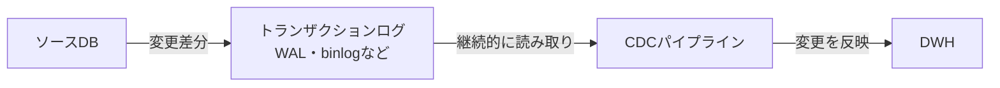

こんにちは、IVRyでデータエンジニアとして働いている松田健司（[@ken_3ba](https://x.com/ken_3ba)）です。趣味はビリヤードで、プロの試合にも出ているぐらい割とガチでやっています。

最近シャフト(キューの上半分の部分)を新調しました。木に色を入れた7色のカラフルなデザインのUNLIMITEDのシャフトがあるのですが、結局いちばん無難な黒を選びました。

*7色のシャフト。*

ビリヤードの話はこのへんにして、本題に入ります。今回はデータの取り込み方法について整理し、どういうときにどの技術を選ぶのかをまとめました。

# TL;DR

- データを取り込む方式を「ゼロコピー」「Change Data Capture(CDC)」「Create or Replace」「クエリベースの増分更新」の4つに整理します
- ユースケースから逆引きして選べる判断基準をまとめます
- 各方式をDatabricksで実現する場合の機能(Lakehouse Federation、Lakeflow Connect、Auto CDC)にも触れます

# はじめに

あまりデータエンジニアリングの経験がない方から「データをDWHに取り込みたいのですが、どうすればいいですか？」と聞かれることがありました。答えるにあたりさまざまなパターンが存在し、要件によって選択する技術が変わるため、説明するのが意外と難しいなーって感じたんですよね。

たとえば、データソースがRDBかストレージかによって選択肢は大きく変わります。そして同じRDBでも、データ量やリアルタイム性の要否によって、適した技術はまったく異なります。

この記事では、データ取り込み方法について整理します。データエンジニアリングの経験がある方には目新しい話は少ないかもしれませんが、判断基準を言語化して残しておくことで新しくチームに入った方への説明や、自分自身の意思決定の見直しに役立ててもらえると嬉しいです。

# データ取得方式について

データの取得方式は、大きく「バッチ」と「ストリーム」の2つに分けられ、さらに近年ではデータを複製せずソースを直接参照する「ゼロコピー」という第3の方式も選択肢に入ってきています。

- **ゼロコピー**: ソースを直接参照し、複製を作らない
- **ストリーム連携**: ソースの変更を継続的に捕捉する方式。Change Data Capture(CDC)が代表例で、変更ログをイベントとして継続的に捕捉する。実際にリアルタイムで取り込めるかは、反映するパイプラインの実行頻度次第
- **バッチ連携**: 一定間隔でまとめてデータを取得する方式。Create or Replace(全件洗い替え)、クエリベースの増分更新(差分更新)が該当する

これらの選択肢をさまざまな観点から評価して整理すると次のようになります。

| 観点 | ゼロコピー | Change Data Capture(CDC) | Create or Replace(全件洗い替え) | クエリベースの増分更新(差分更新) |
|---|---|---|---|---|
| 概要 | ソースにクエリを都度発行し参照する | ソースの変更ログを継続的に捕捉する | 全件を取得し、テーブルごと洗い替える | 更新日時カラムなどで差分を抽出し、追記・更新する |
| 分類 | ゼロコピー | ストリーム連携 | バッチ連携 | バッチ連携 |
| リアルタイム性 | 高い(常にソースの最新値) | 中程度(短くても数十秒〜数分間隔が限界) | 低い(日次・時間次が一般的) | 中程度(短くても数十秒〜数分間隔が限界) |
| 適したデータ量 | 小〜中規模 | 大規模 | 小〜中規模 | 中〜大規模 |
| コスト | 低い(ストレージ・取り込みジョブのコストはなし) | 高い(ストレージコストが発生し、常時稼働ならジョブのコストも高い) | 中(ストレージコストが発生し、実行頻度に応じてジョブのコストがかかる) | 中(ストレージコストが発生し、実行頻度に応じてジョブのコストがかかる) |
| ソース側の負荷 | 高(クエリのたびに発生) | 低(ログ読み取りのみ) | 高(全件スキャン) | 中(差分抽出クエリ) |
| 実装難易度 | 低 | 高 | 低 | 中 |
| 運用コスト(保守性) | 低(構成がシンプルで運用しやすい) | 高(ログ基盤の監視が必要) | 低(シンプルで運用しやすい) | 中 |
| UPDATE/DELETE | 最新の状態が反映されるが履歴をもたない | 最新の状態が反映され、設計次第で履歴も保持できる | 最新の状態が反映されるが履歴をもたない | UPDATEは反映可能だがDELETEは不可 |
| Databricksの機能 | [Lakehouse Federation](https://docs.databricks.com/aws/en/query-federation) | [Lakeflow Connect](https://docs.databricks.com/aws/en/ingestion/lakeflow-connect/)、[Auto CDC](https://docs.databricks.com/aws/en/dlt-ref/dlt-python-ref-apply-changes) | [Lakeflow Jobs](https://www.databricks.com/product/data-engineering/lakeflow-jobs)で`CREATE OR REPLACE`(パーティション単位なら`REPLACE WHERE`)を定期実行 | [Lakeflow Jobs](https://www.databricks.com/product/data-engineering/lakeflow-jobs)で`MERGE INTO`を定期実行 |

## ゼロコピー

ソースのデータをコピーせず、クエリ実行時にソース側へアクセスして直接参照する方式です。Databricksでは[Lakehouse Federation](https://docs.databricks.com/aws/en/query-federation)が代表例で、外部DBをコピーせずUnity Catalog経由で仮想的に見せられます。

直接DWHにコピーが存在しないため、ETLジョブや取り込み用バケット自体が不要になります。さらにソース側でテーブルやスキーマが追加されても自動で追従するため、開発・運用コストとストレージコストを大きく下げられます。ソースをそのまま参照するのでリアルタイム性も確保できます。

一方で、クエリのたびにソースDBへ負荷がかかるため、大規模テーブルや高頻度アクセスには向きません。さらに、接続設定が途切れたりソースDB側に障害が起きたりすると、1件も参照できなくなります。そのため、外部連携や本番のプロダクト機能として使うのには適していません。

IVRyではViewを作成してアクセスする形にし、マスタテーブルのような大規模でないテーブルを社内で参照する用途に絞って利用しています。導入事例は以下の記事にまとめています。

https://zenn.dev/ivry/articles/databricks-lakehouse-federation-guide

## Change Data Capture(CDC)

ソースDBのトランザクションログ(PostgreSQLのWAL、MySQLのbinlogなど)を読み取り、INSERT/UPDATE/DELETEの変更差分を検知して反映する方式です。ソース側のテーブルに更新の痕跡(`updated_at`など)がなくても、変更を取りこぼさず追跡できるのが最大の強みです。

CDC自体は変更ログを検知する手法であり、それ自体がリアルタイム性を保証するわけではありません。捕捉した変更をどのくらいの頻度で反映するパイプラインとして動かすかによって鮮度が決まり、短くても数十秒〜数分間隔での反映が現実的な水準です。常時稼働させるほど鮮度は上がりますがコストも高くなるため、定期的にマイクロバッチとして実行する運用もよく取られます。

削除の検知やイベントの発生順序も含めて正確に扱えるため、鮮度と正確性の両方が求められるケースに向きます。捕捉した変更イベントをそのまま蓄積すれば、設計次第で変更履歴を保持することも可能です。ユースケースとしては、大規模なテーブルで過去のレコードに遡ってUPDATEやDELETEが頻繁に発生するようなデータに適しています。特に物理削除(DELETE)を正確に検知できるのは4方式の中でCDCだけで、更新日時カラムに頼る方式では原理的に捉えられません。

一方で、ログ基盤の構築・監視やスキーマ変更への追従が必要で、実装・運用コストは4方式の中でもっとも高くなります。パフォーマンスチューニングの難易度が高いことや、失敗時の再実行が他の方式より難しいことも実務上のハードルです。

Databricksでは、このハードルをマネージドで下げる手段が2つ用意されています。[Lakeflow Connect](https://docs.databricks.com/aws/en/ingestion/lakeflow-connect/)はCDCを含む取り込みをコネクタの設定だけで構築できる便利な機能です。
自前でパイプラインを組む場合も、[Auto CDC](https://docs.databricks.com/aws/en/dlt-ref/dlt-python-ref-apply-changes)(旧`APPLY CHANGES`)を使えば順序保証や重複排除、スキーマ変更への追従を宣言的に簡易に扱えます。

IVRyでは大規模テーブルの連携にクエリベースの増分更新やパーティション単位の洗い替えを使っており、CDCはまだ本格導入していません。今後、鮮度要件がより厳しくなった場合の選択肢として検討している段階です。

## Create or Replace(全件洗い替え)

ソースの全件を取得し、既存テーブルをまるごと置き換える方式です。実装がもっともシンプルです。冪等性も担保しやすく、失敗時は単純に再実行すればよいという扱いやすさがあります。

Databricksでは[Lakeflow Jobs](https://www.databricks.com/product/data-engineering/lakeflow-jobs)で`CREATE OR REPLACE`(パーティション単位なら`REPLACE WHERE`)を定期実行する形で実現します。dbtでDWH内のモデルを構築している場合も、マテリアライゼーションを`table`に設定すれば同様に洗い替えの形でモデルが再構築されます。

一方で、データ量に比例して転送・処理コストが増えるため、大規模テーブルには不向きです。またソース側の値がすでに書き換わっていると、洗い替えのタイミングによっては過去時点のスナップショットが失われる点に注意が必要です。マスタテーブルなど、変更頻度が低くレコード数が少ないデータに向いた方式です。

ゼロコピーと違い、クエリのたびにソースへ問い合わせるわけではないため、ネットワークの問題でデータが読めなくなるといった事態が起きません。この点で外部連携や本番のプロダクト機能にも適しています。ただし、リアルタイム性はバッチの実行頻度に依存するため、鮮度が厳しく求められる用途には向きません。

IVRyでは一部のテーブルで、dbtを利用してDeltaテーブルを洗い替える自前のジョブを運用しています。

## クエリベースの増分更新

`updated_at`などで更新を判定できるカラムを使って差分だけを抽出し、追記または更新する方式です。全件取得よりも転送量を抑えられ、CDCほどの実装コストもかかりません。バッチジョブとして定期実行するのが基本で、CDCのようなストリーム処理ではないため、実行間隔を短くしても数十秒〜数分単位が限界です。

Databricksでは[Lakeflow Jobs](https://www.databricks.com/product/data-engineering/lakeflow-jobs)で`MERGE INTO`を定期実行する形で実現します。dbtでDWH内のモデルを構築している場合も、マテリアライゼーションを`incremental`に設定すれば同様に差分だけモデルへ反映されます。

制約として、更新日時カラムに頼る以上、物理削除は検知できません。ソース側でレコードが削除されても、その情報は更新日時カラムに現れないため、DWH側には削除前のレコードが残り続けます。また、ソース側に更新日時カラムがそもそもない場合は使えません。アプリケーション側で更新日時カラムの更新を忘れる実装ミスがあると、その行だけ差分抽出から漏れるというデータ品質上のリスクもあります。

抽出した差分をDWH側に反映する際は`MERGE INTO`を使うのが一般的ですが、`ON`句の絞り込み条件次第ではファイルスキップが効かず、テーブル全体のスキャンが発生してパフォーマンスが悪化することがあります。この挙動は以下の記事で内部処理まで含めて解説しています。

https://zenn.dev/ivry/articles/delta-lake-merge-into-internals-and-clustering

IVRyでは[dlt(data load tool)](https://dlthub.com/)やdbtを利用して、差分更新するパイプラインを大規模テーブルの取り込みに利用しています。

# どう選ぶか

ここまで見てきたように選択肢や特徴はさまざまですが、どういうときに何を選ぶかを見極めることこそが技術選定の肝だと思っています。私が意識している観点を整理すると、次のようになります。

| 利用シーン | データ量 | リアルタイム性 | 更新日時カラム・削除検知 | 適した方式 |
|---|---|---|---|---|
| 社内利用 | 小 | 問わない | 問わない | ゼロコピー |
| 問わない | 小 | 低くてよい | 問わない | Create or Replace |
| 問わない | 大 | 低くてよい | 更新日時カラムがあり、削除検知は不要 | クエリベースの増分更新 |
| 問わない | 大 | 高さを求める | 更新日時カラムがない、または削除も正確に検知したい | CDC |

# まとめ

データ取り込みの技術選定は、「ゼロコピー」「CDC」「Create or Replace」「クエリベースの増分更新」の4つの取得方式を軸に考えると整理しやすくなります。

要件を正しく見極め、それに応じた技術を選定することが何より大事です。

そして、どれも一度決めたら終わりではなく、データ量の増加や鮮度要件の変化といったタイミングで見直すものです。CDCから入って過剰に作り込むより、まずCreate or Replaceやクエリベースの増分更新で動かしてみて、要件が厳しくなってから乗り換える順番の方が、結果的に手戻りが少ないと感じています。

---

IVRyのデータチームに興味を持った方は、以下のページもあわせてご覧ください。

https://ivry.jp/lp-article/data-team/
