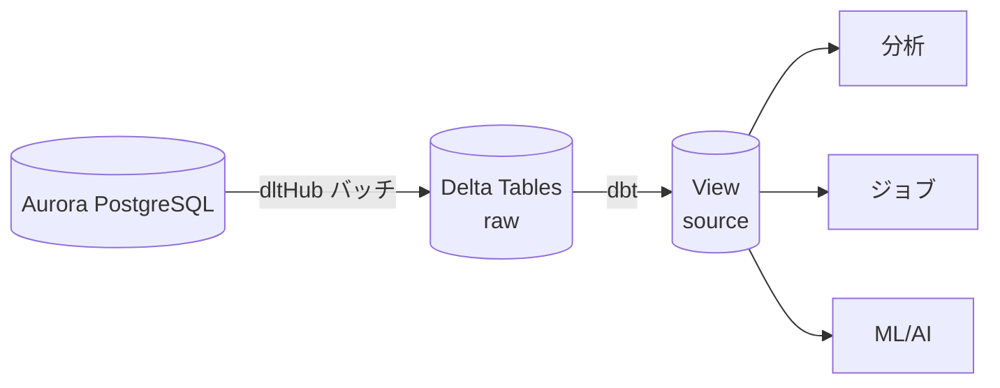
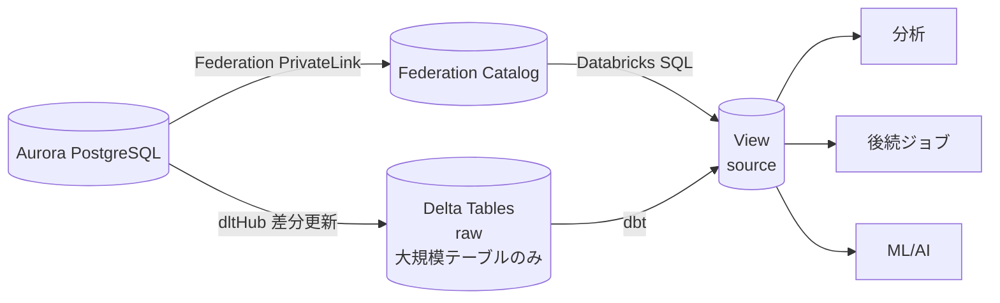
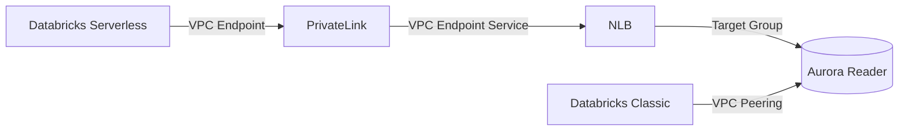
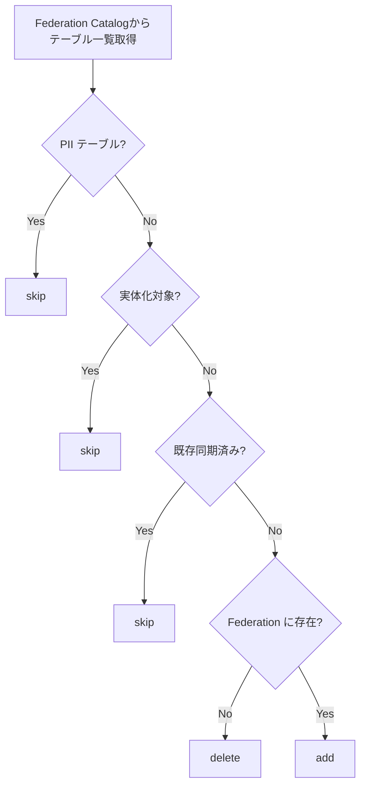

こんにちは、IVRyでデータエンジニアとして働いている松田健司（[@ken_3ba](https://x.com/ken_3ba))です。趣味はビリヤードで、プロの試合にも出ているぐらい割とガチでやっています。

先日、年に一度のアマチュア最大の大会「全日本アマチュアナインボール選手権大会」の東京予選に出場しました。101人中わずか6人しか本選に進めない狭き門で、9ボールの7先（先に7ラック取った方が勝ち）で戦います。2回戦まで進んだのですが、6-6のヒルヒル（お互いあと1ラックで勝ち）から最後にミスして敗退しました。悔しい...


*全日本アマチュアナインボール選手権大会の本選特設会場。いつかここで撞きたい。*

さて、本日のビリヤードの話はこのへんで切り上げて本題に入ります！

# はじめに

今回は、Databricks Lakehouse Federationを導入し、PostgreSQL（Aurora）のデータをViewを通じて社内のデータ基盤環境であるDatabricksからアクセスできるようにした話をします。これまではプロダクトでテーブルが追加されるたびに、ジョブを組んでバッチでデータ連携していましたが、Federationへの移行により**依頼や運用負荷ゼロ**のデータ連携を実現しました。

この記事では、導入の背景・構成・設定のポイントについてお伝えします。

# Lakehouse Federationを利用する背景

## Lakehouse Federationとは

Lakehouse Federationは、外部のデータベース（PostgreSQL、MySQL、BigQueryなど）のデータをDatabricksにコピーすることなく、Unity Catalogを通じて直接クエリできる機能です。

主なメリットは以下になります。

- **データのコピーが不要**: ETLジョブでデータを取り込む必要がなく、ジョブとストレージコストを削減できる
- **リアルタイム参照**: バッチ処理がないため、ソースDBの最新データを直接参照できる
- **Unity Catalogによるガバナンス**: 外部データソースもUnity Catalogで一元管理でき、アクセス制御やリネージが統一される

https://docs.databricks.com/aws/en/query-federation

## AS-IS: バッチ同期による連携

Lakehouse Federationを導入する前のIVRyのデータ・AI基盤の全体構成は、以前Findy Toolsで公開した通りです。

*引用: [Findy Tools - IVRyのデータ・AI基盤](https://findy-tools.io/companies/ivry/90/76)*
https://findy-tools.io/companies/ivry/90/76

このアーキテクチャのうち、Aurora PostgreSQLのデータ連携部分では[dltHub](https://dlthub.com/)を使ってDelta Tableにバッチ同期し、Databricksにデータをコピーしていました。

プロダクト側で新しいテーブルやカラムが追加されると、データ基盤で利用するには以下の手順が必要でした。

1. 開発者がSlackでテーブル追加を申請

2. データエンジニアがdltHubのジョブに対象テーブルを追加し、生データをDelta Tableに取り込む
3. dbtでsourceのViewを作成

データの構成は以下のようになっていました。


そのため、この構成や運用業務には以下の課題がありました。

- **運用負荷**: テーブル追加の依頼対応やジョブのコード追加、定期実行の監視・障害対応が必要
- **データ鮮度の限界**: バッチ処理のため、リアルタイム性が失われる
- **ジョブ/ストレージコスト**: データをコピーするため、ストレージとジョブ実行のコストがかかる


# アーキテクチャ

## 前提条件

Lakehouse Federationを利用するにはいくつかの前提条件があります。

- **Enterpriseプラン**が必要（Serverless SQL Warehouseの利用に必要）
- **Unity Catalog**が有効なワークスペース
- **SQL Warehouse**: Pro または Serverless（バージョン2023.40以上）
- **Databricks Runtime**: 13.3 LTS 以上（Standard or Dedicated アクセスモード）
- コンピュートからターゲットDBへの**ネットワーク接続**

IVRyは今までPremiumプランだったため、Enterpriseプランへのアップグレードはコストに直結し、事前の費用対効果の検討が必要でした。Enterpriseプランにすることで主にジョブのコストが30%あがりますが、Ingestジョブのコストが削減される点や運用負荷が軽減される点を踏まえ、十分に有益だと判断しEnterpriseプランへ変更しました。なお、SQLのコストはプランによって差異はないため、今まで通りTransformはdbtを利用する方針としました。

## TO-BE: Federation導入後のアーキテクチャ

dltHubをLakehouse Federationに置き換えることで、Aurora PostgreSQLのデータをDatabricksからリアルタイムに直接参照できるようになります。データを取り込むジョブが不要になり、上記の課題が解決されました。地味に運用負荷が高かった依頼と作成業務がゼロになったのが個人的にはとても嬉しいです。




ただし、すべてのデータをLakehouse Federationに置き換えたわけではなく、**大規模テーブルはdltHubによる差分更新を維持する二層構造**にしたことがポイントです。Federationはクエリ時にリモートDBへアクセスするため、大量データを直接DBからスキャンするにはパフォーマンス面での課題があり、このような方針にしました。

Federationのパフォーマンスに関する詳細は公式の推奨事項を参照してください。

https://docs.databricks.com/aws/en/query-federation/performance-recommendations


## ネットワーク構成: Serverless と Classic の接続方式

Databricksには**Serverless**と**Classic**の2種類のコンピュートがあり、それぞれFederationの接続方式が異なります。

| | Serverless | Classic |
|---|---|---|
| PostgreSQL | PrivateLink (NCC) 経由 | VPC Peering 経由 |

Serverlessの場合、Databricksが管理するVPCからPrivateLink経由でAuroraに接続します。




https://docs.databricks.com/aws/en/query-federation/postgresql

https://docs.databricks.com/aws/en/security/network/serverless-network-security/pl-to-internal-network

https://docs.databricks.com/aws/en/query-federation/foreign-catalogs

## テーブル同期の自動化

アーキテクチャが決まった後は、実際にdltHubからFederationへ乗り換えるためのNotebookジョブを作成しました。

### テーブル選択の自動化

Federationカタログには大量のテーブルが存在するため、どのテーブルをFederation経由にするかを自動判定する仕組みを構築しました。



各処理の意味は以下の通りです。

- **skip**: Federation対象外としてスキップする。以下のテーブルが該当
  - **PIIテーブル**: 個人情報を含むテーブルは自動同期時に意図せず追加されるリスクを排除するため除外
  - **実体化対象テーブル**: 大規模テーブルなど、Federationではパフォーマンスに課題があるため、今まで通りdltHubによる差分更新とdbtでのView作成を行う
  - **既存同期済みテーブル**: すでにView同期が完了しているテーブル
- **add**: Federation Catalogに存在する新規テーブルをView同期の対象に追加
- **delete**: プロダクト側のデータベースから削除されたテーブルのViewを削除対象にする

判定ロジックの実行結果はメタデータテーブルに格納し、後続のView生成処理で参照します。

### テーブル追加時の自動ビュー生成

上記で作成したメタデータテーブルに基づいて、ビューを自動作成/削除する仕組みを作成しました。addのテーブルに対してはViewの作成、deleteのテーブルに対してはViewの削除を自動で行います。

これにより、PostgreSQL側でテーブルが追加や削除されると、次回のsync時に自動でビューが反映される仕組みになっています。

# 設定時にハマったところ

## NLBのPrivateLink設定

NCCの設定でDatabricks側はEstablished、AWS側の設定も適切に見えるのに、なぜかPrivateLink経由でアクセスできない問題がありました。

何度もサポートに問い合わせて確認したところ、PrivateLink経由でNLBに接続する場合、NLBの `enforce_security_group_inbound_rules_on_private_link_traffic` を **OFF** にする必要があり、この設定がデフォルトのONのままでした。この設定がONだと、PrivateLink経由のトラフィックがセキュリティグループのインバウンドルールによってブロックされます。PrivateLink経由のソースIPは予測不能なため、セキュリティグループで許可することが困難です。

```hcl
resource "aws_lb" "federation" {
  # ...
  enforce_security_group_inbound_rules_on_private_link_traffic = "off"
}
```

公式ドキュメントにもこの設定について記載があったのですが、見落としてしまい設定に時間がかかりました。

> Go to Endpoint services and select the Network Load Balancer you just created. From there, navigate to the Security tab and verify that Enforce inbound rules on PrivateLink traffic is Off.

## NCC（Network Connectivity Configuration）の設定

NCCについて、ワークスペースは**単一のNCCにしかバインドできない**（別のNCCをバインドすると前のNCCが暗黙的に上書きされる）という制約がありました。さらに**NCC bindingは手動で消せない**ため、もう一度Terraformでreplaceする必要があり、再度AWS側で疎通の許可をしなければなりませんでした。

この制約は公式ドキュメントに記載がなかったため、terraform-provider-databricksに[PR #5401](https://github.com/databricks/terraform-provider-databricks/pull/5401)を提出し、制約事項を追記しました。

IVRyでは、stg/prodでNCCを分けず**全ワークスペースを1つのNCCに統合**する方針で運用しています。

## サーバレスとクラシックで接続ルートが異なる

[ネットワーク構成](#ネットワーク構成-serverless-と-classic-の接続方式)でも記載した通り、サーバレスとクラシックではFederationの接続方式が異なります。IVRyではサーバレスをメインで動かしていたのですが、一部のジョブがクラシックのままだったため、View経由でFederationカタログを参照するジョブがエラーになりました。


# まとめ

Lakehouse Federationの導入により、これまでテーブルごとにジョブを組んでバッチ連携していた運用が大きく変わりました。プロダクト側でテーブルが追加されると自動的にViewが作成され、データエンジニアへの依頼や手動でのジョブ追加が不要になりました。バッチの遅延もなくなり、リアルタイムに近いデータ参照が可能です。ジョブ実行やストレージのコストも削減できています。
大規模テーブルとPIIテーブルはFederationから除外し、安全かつパフォーマンスの良い構成にしています。

ただ、Federationを導入したことにより、データ削除時に後続のデータ利用に影響が出る問題が出てきました。こちらについては今後の対応予定です。

また、大規模テーブルについてはまだdltHubが残っているため、Databricksの[Lakehouse Connect](https://docs.databricks.com/aws/en/lakehouse-connect/)を利用したCDC更新へ移行して、よりリアルタイムにコスト削減した連携ができればと考えています。

---

IVRyではキャリア登録やカジュアル面談の機会をご用意しています。ご興味のある方はぜひ以下よりお申し込みください。

https://herp.careers/v1/ivry/wmZiOSAmZ4SQ
https://www.notion.so/209eea80adae800483a9d6b239281f1b?pvs=21
