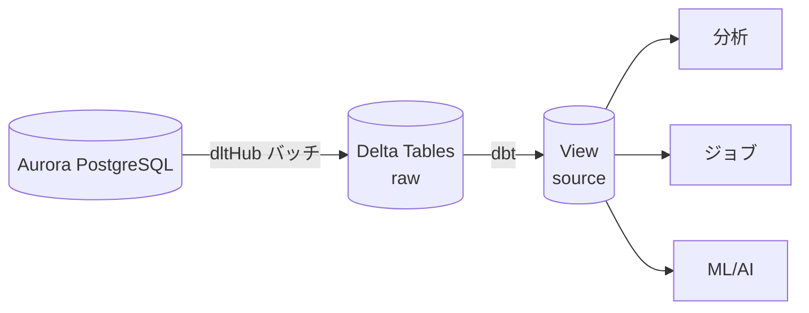
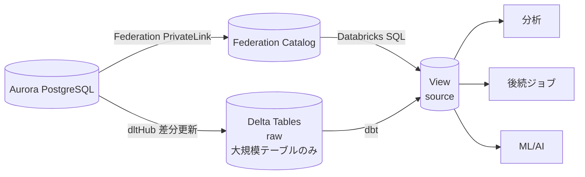
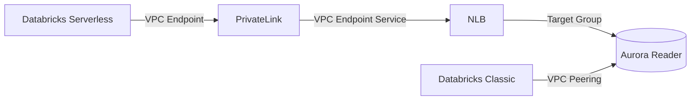
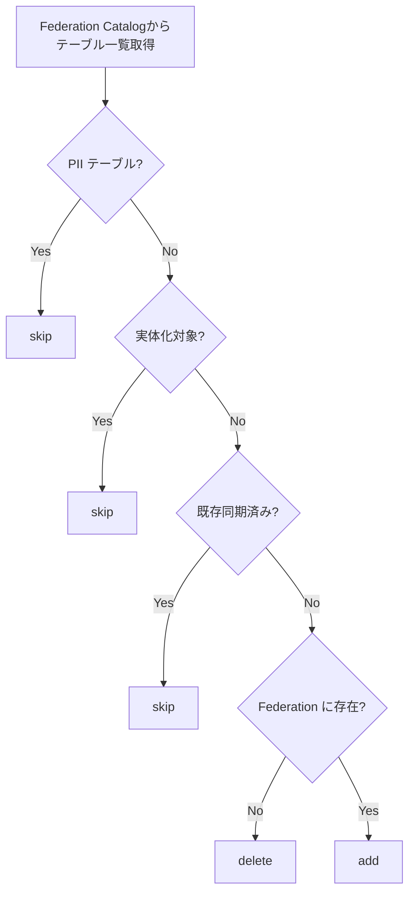

こんにちは、IVRyでデータエンジニアとして働いている松田健司（[@ken_3ba](https://x.com/ken_3ba))です。趣味はビリヤードで、プロの試合にも出ているぐらい割とガチでやっています。

<!-- TODO: ビリヤード小話をここに書く -->

さて、本日のビリヤードの話はこのへんで切り上げて本題に入ります！

# はじめに

今回は、Databricks Lakehouse Federationを導入し、PostgreSQL（Aurora）のデータをViewを通じて社内のデータ基盤環境であるDatabricksからアクセスできるようにした話をします。これまではプロダクトでテーブルが追加されるたびに、ジョブを組んでバッチでデータ連携していましたが、Federationへの移行により**依頼や運用負荷ゼロ**のデータ連携を実現しました。

この記事では、導入の背景・構成・設定のポイントについてお伝えします。

# Lakehouse Federationを利用する背景

## AS-IS: バッチ同期による連携

IVRyのデータ・AI基盤の全体構成は以下の通りです。

https://findy-tools.io/companies/ivry/90/76

このうちAurora PostgreSQLのデータ連携部分では、[dltHub](https://dlthub.com/)を使ってDelta Tableにバッチ同期していました。

プロダクト側で新しいテーブルやカラムが追加されると、データ基盤で利用するには以下の手順が必要でした。

1. 開発者がSlackでテーブル追加を申請
2. データエンジニアがdltHubのジョブに対象テーブルを追加し、生データをDelta Tableに取り込み
3. dbtでsourceのViewを作成

そして、データの構成は以下のようになっていました。


そのため、この構成や運用業務には以下の課題がありました。

- **運用負荷**: テーブル追加の依頼対応やジョブのコード追加、定期実行の監視・障害対応が必要
- **データ鮮度の限界**: バッチ処理のため、リアルタイム性が失われる
- **ジョブ/ストレージコスト**: データをコピーするため、ストレージとジョブ実行のコストがかかる

## TO-BE: Federation導入後

Lakehouse Federationを使えば、Aurora PostgreSQLのデータをDatabricksからリアルタイムに直接参照できます。そのため、データを取り込むジョブが不要になり、上記の課題が解決されました。とくに地味に運用負荷が高かった依頼と作成業務がゼロになったのが個人的にはとても嬉しいです。




ポイントは、**すべてをFederationに移行するのではなく、大規模テーブルはdltHubによる差分更新を維持する二層構造**にしたことです。Federationはクエリ時にリモートDBへアクセスするため、大量データを直接DBからスキャンするにはパフォーマンス面での課題があったためです。

Lakehouse Federationについては以下の公式ドキュメントをみていただけると。

https://docs.databricks.com/aws/en/query-federation/

# アーキテクチャと設計

## 前提条件

Lakehouse Federationを利用するにはいくつかの前提条件があります。

- **Enterpriseプラン**が必要（Serverless SQL Warehouseの利用に必要）
- **Unity Catalog**が有効なワークスペース
- **SQL Warehouse**: Pro または Serverless（バージョン2023.40以上）
- **Databricks Runtime**: 13.3 LTS 以上（Standard or Dedicated アクセスモード）
- コンピュートからターゲットDBへの**ネットワーク接続**

特にEnterpriseプランへのアップグレードはコストに直結するため、事前の費用対効果の検討が必要です。

## ネットワーク構成: Serverless と Classic の接続方式

Databricksには**Serverless**と**Classic**の2種類のコンピュートがあり、それぞれFederationの接続方式が異なります。

| | Serverless | Classic |
|---|---|---|
| PostgreSQL | PrivateLink (NCC) 経由 | VPC Peering 経由 |
| BigQuery | インターネット経由 | インターネット経由 |

Serverlessの場合、Databricksが管理するVPCからPrivateLink経由でAuroraに接続します。



以下を参考に設定しました。

https://docs.databricks.com/aws/en/query-federation/postgresql

https://docs.databricks.com/aws/en/security/network/serverless-network-security/pl-to-internal-network

https://docs.databricks.com/aws/en/query-federation/foreign-catalogs

## バッチ同期からの乗り換え

### テーブル選択の自動化

Federationカタログには大量のテーブルが存在するため、どのテーブルをFederation経由にするかを自動判定する仕組みを構築しました。



各処理の意味は以下の通りです。

- **skip**: Federation対象外としてスキップ。以下のテーブルが該当
  - **PIIテーブル**: 個人情報を含むテーブルは自動同期時に意図せず追加されるリスクを排除するため除外
  - **実体化対象テーブル**: 大規模テーブルなど、Federationではパフォーマンスに課題があるためdltHubによる差分更新を維持しているもの。Federationはクエリ時にリモートDBへアクセスするため、大量データのスキャンには向かない
  - **既存同期済みテーブル**: すでにView同期が完了しているテーブル
- **add**: Federation Catalogに存在する新規テーブルをView同期の対象に追加
- **delete**: Federation Catalogから削除されたテーブルのViewを削除対象にする

判定ロジックの実行結果はメタデータテーブルに格納し、後続のView生成処理で参照します。

Federationのパフォーマンスに関する詳細は公式の推奨事項を参照してください。

https://docs.databricks.com/aws/en/query-federation/performance-recommendations

### テーブル追加時の自動ビュー生成

メタデータに基づいてビューを自動作成/削除する仕組みも用意しました。

- PostgreSQL側にテーブルが追加されると、次回sync時に自動でビューが作成される
- 単一テーブルのエラーで全体が停止しない設計
- テーブル選択 → ビュー同期の順でジョブとして実行

# 設定のハマりどころ

## NLBのPrivateLink設定

PrivateLink経由でNLBに接続する場合、NLBの `enforce_security_group_inbound_rules_on_private_link_traffic` を **OFF** にする必要があります。

この設定がデフォルトのONのままだと、PrivateLink経由のトラフィックがセキュリティグループのインバウンドルールによってブロックされます。PrivateLink経由のソースIPは予測不能なため、セキュリティグループで許可することが困難です。

```hcl
resource "aws_lb" "federation" {
  # ...
  enforce_security_group_inbound_rules_on_private_link_traffic = "off"
}
```

セキュリティ面については、VPC Endpoint Serviceの `allowed_principals` でDatabricksアカウントのみに接続を制限できます。

公式ドキュメントにもこの設定について記載があります。

> Go to Endpoint services and select the Network Load Balancer you just created. From there, navigate to the Security tab and verify that Enforce inbound rules on PrivateLink traffic is Off.

自分はこの記載を見落としてサポートに問い合わせるという凡ミスをしました。PrivateLink + NLBの構成に慣れていないと見逃しがちなポイントなのでご注意ください。

## NCC（Network Connectivity Configuration）の設定

NCCについて押さえておくべきポイントです。

- ワークスペースは**単一のNCCにしかバインドできない**（別のNCCをバインドすると前のNCCが暗黙的に上書きされる）
- **NCC bindingは手動で消せない**

この制約は公式ドキュメントに記載がなかったため、terraform-provider-databricksに[PR #5401](https://github.com/databricks/terraform-provider-databricks/pull/5401)を提出し、制約事項を追記しました。

IVRyでは、stg/prodでNCCを分けず**全ワークスペースを1つのNCCに統合**する方針で運用しています。

# まとめ

Lakehouse Federationの導入により、これまでテーブルごとにジョブを組んでバッチ連携していた運用が大きく変わりました。プロダクト側でテーブルが追加されると自動的にViewが作成され、データエンジニアへの申請や手動でのジョブ追加が不要になりました。バッチの遅延もなくなり、リアルタイムに近いデータ参照が可能です。ジョブ実行やストレージのコストも削減できています。

設定面では、Enterpriseプラン + Unity Catalogが前提となること、NLBのPrivateLink設定で`enforce_security_group_inbound_rules_on_private_link_traffic`をOFFにする必要があること、NCCは1ワークスペースに1つしかバインドできない制約があることが主なポイントです。大規模テーブルとPIIテーブルはFederationから除外し、安全かつパフォーマンスの良い構成にしています。

残課題としては、データ削除時に後続のデータ利用に影響が出る問題があり、今後の対応予定です。また、現在dltHubで差分更新を行っている大規模テーブルについては、Databricksの[Lakehouse Connect](https://docs.databricks.com/aws/en/lakehouse-connect/)への移行を検討しています。

---

IVRyではデータエンジニアを募集しています！興味のある方は[採用情報](https://ivry-jp.notion.site/IVRy-e1d47e4a79ba4f8e81c1a1cb3e34dc18)をご覧ください。
