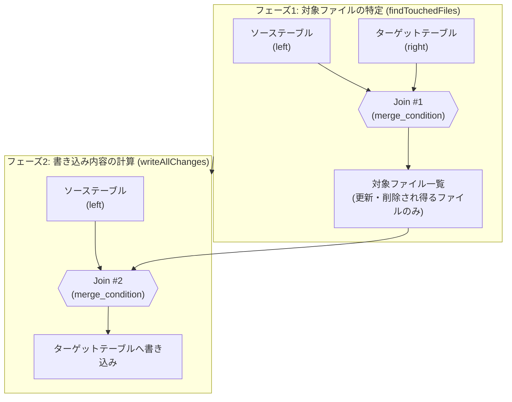
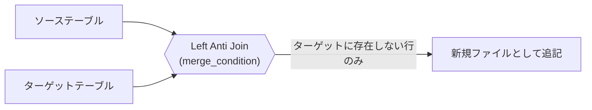

こんにちは、IVRyでデータエンジニアとして働いている松田健司（[@ken_3ba](https://x.com/ken_3ba)）です。
趣味はビリヤードで、プロの試合にも出ているぐらい割とガチでやっています。

先日、青森で開催された「あおもりビリヤードチャリティトーナメント」に参加してきました。
51名が参加する大会で、決勝まで勝ち上がったものの、最後は一歩及ばず準優勝でした。


*あおもりビリヤードチャリティトーナメントの表彰式にて。左が筆者です*

ビリヤードの小話はここまでにして、今回はDelta Lakeの`MERGE INTO`についてお話しします。

Databricksを利用していく上で差分更新をしたいといったときに`MERGE INTO`はDelta Lakeを使ううえで避けて通れない構文です。
簡易に利用できるのですが、内部で何が起きているかを意識せずに使うと、思ったより処理に時間がかかったり、コストがかかったりするといった壁にぶつかります。そして、中の構文は結構複雑だったりして、理解するのはなかなか大変です。

本記事では、Delta LakeのOSSコードを読みながら`MERGE INTO`の内部処理について整理します。

# TL;DR

- `MERGE INTO`は内部的に2段階のジョインで実行される。フェーズ1でファイルを絞り込み、フェーズ2で書き込み内容を計算する。
- ジョイン種別（Inner / Left Outer / Right Outer / Full Outer / Left Anti）は、`WHEN`句の組み合わせとDeletion Vectors（DV）の有効・無効で決まる。
- Insert-only MERGEは`Left Anti`になり、既存ファイルを一切書き換えない。
- Z-orderやLiquid Clusteringによるデータスキッピングは、ソース側の絞り込み条件が狭いときしか効かない。

# MERGE INTOについて

`MERGE INTO`は、ソース側のデータをキーで突き合わせながらターゲットテーブルを更新する構文です。よくある使いどころは以下のようなケースです。

- **Upsert**: ソースのキーがターゲットに存在すれば更新、存在しなければ挿入する基本パターン
- **CDC・SCDの反映**: 変更データキャプチャ（CDC）で届いた差分を、SCD Type 1（上書き）やType 2（履歴保持）としてターゲットテーブルに反映する

`MERGE`は[他の同時書き込みと競合しやすい操作](https://docs.delta.io/latest/concurrency-control.html)でもあります。`ON`句や`matched_condition`でパーティション列などの絞り込み条件を明示しないと、テーブル全体をスキャンする形になり、他のパーティションを更新する並行処理とも競合しやすくなります。後述する「絞り込み条件を足すとファイルスキップが効く」という話は、パフォーマンスだけでなく同時実行時の競合を避けるという観点でも意味を持ちます。

Databricks SQL / Delta Lakeの`MERGE INTO`は次の構文になります。

```sql
MERGE [ WITH SCHEMA EVOLUTION ] INTO target_table_name [target_alias]
  USING source_table_reference [source_alias]
  ON merge_condition
  { WHEN MATCHED [ AND matched_condition ] THEN matched_action |
    WHEN NOT MATCHED [BY TARGET] [ AND not_matched_condition ] THEN not_matched_action |
    WHEN NOT MATCHED BY SOURCE [ AND not_matched_by_source_condition ] THEN not_matched_by_source_action } [...]
```

`target_table_name`が更新される側のDeltaテーブル（**ターゲットテーブル**）、`USING`句に指定するのが更新内容の元になるテーブル（**ソーステーブル**）です。ソーステーブルはDeltaテーブルである必要はなく、CSVから読み込んだDataFrameやCTE、別形式のテーブルなど、Sparkでクエリできるものであれば何でも指定できます。CDCパイプラインであれば「今回のバッチで届いた変更差分」、Upsertバッチであれば「最新の状態を持つ外部テーブル」がソーステーブルにあたり、`ON merge_condition`で指定したキーでターゲットテーブルの各行と突き合わせて、`WHEN`句に応じた`UPDATE`/`DELETE`/`INSERT`を行います。

3種類の`WHEN`句があり、どれを書くか・書かないかの組み合わせによってMERGEの意味、そして内部で使われるジョイン戦略が変わります。この対応関係は紛らわしいので、次の章で先に整理しておきます。

# MERGE INTOの内部動作の詳細

Delta LakeのOSS実装（[delta-io/delta](https://github.com/delta-io/delta/blob/v3.2.0/spark/src/main/scala/org/apache/spark/sql/delta/commands/MergeIntoCommand.scala)）を見ると、`MERGE INTO`は大きく2つのフェーズで構成されていることが分かります。

## 用語の整理

解説を読み進める前に、混同しやすい用語の対応関係を先に整理しておきます。文中では`source`（ソーステーブル）と`target`（ターゲットテーブル）という言葉が繰り返し出てきます。

| 用語 | 指すもの |
|---|---|
| `source` | 今回のバッチ・差分のデータ |
| `target` | 更新される側のデータ |

内部のコードは一貫して`sourceDF.join(targetDF, condition, joinType)`という書き方をしています。`.join()`を呼ぶ側（ドットの前）が`left`、引数に渡す側が`right`です。つまり`left = source`、`right = target`という対応になります。「`s`ourceは`l`eft、`t`argetは`r`ight」とアルファベットの並びで覚えると混同しにくくなります。

`WHEN`句の名前も紛らわしいので、あわせて整理します。

| 句 | 実際にどの行を指すか | 主なアクション |
|---|---|---|
| `WHEN MATCHED` | sourceとtargetの**両方**に存在する行 | UPDATE / DELETE |
| `WHEN NOT MATCHED`（`BY SOURCE`なし） | **source**にしかない行（新しく届いた行） | INSERT |
| `WHEN NOT MATCHED BY SOURCE` | **target**にしかない行（もう届かなくなった行） | UPDATE / DELETE |

`NOT MATCHED BY SOURCE`は「ソースによってマッチされない」という意味で、主語はtargetの行です。`BY SOURCE`が付いている方が指している行はtarget側にしかない行になる、という点が直感に反して混同しやすいポイントです。「`NOT MATCHED`（無印）はINSERT用の新規行、`BY SOURCE`が付いたらtargetのお片付け用」と覚えておくと区別しやすくなります。

## フェーズで見るMERGE INTOの内部動作

用語が整理できたところで、`MERGE INTO`をおおまかにフェーズで分けて見ていきます。

1. **フェーズ1: 対象ファイルの特定（`findTouchedFiles`）**: ソーステーブルとターゲットテーブルをマージキーでジョインし、更新・削除の対象になり得る**ファイルを特定する**
2. **フェーズ2: 書き込み内容の計算（`writeAllChanges` / `writeDVs`）**: ソーステーブルと、フェーズ1で見つかった対象ファイルを再度ジョインし、**実際に書き込む内容を計算する**

フェーズ1は「どのファイルを読み直す必要があるか」を絞り込むための軽量なジョイン、フェーズ2は実際にデータを書き出すための本番ジョインという役割分担です。ここでファイル単位のデータスキッピングが効くかどうかが、パフォーマンスを大きく左右します。全体像は次のようになります。



<!-- TODO(画像・優先度中): 上記Mermaid図をFigmaの図に差し替える。left/rightどちらがsource/targetか、target/sourceのテーブル→ジョイン→対象ファイル特定の流れが一目でわかる図にする。この後の「フェーズ1のジョイン種別」「フェーズ2のジョイン種別」の各見出し直下にも、それぞれのフェーズだけを抜き出した図を追加するとよい -->

実際のコード（`MergeIntoCommand.scala`）を単純化すると、全体の制御フローはおおよそ次のようになっています。

```scala
// フェーズ1: 対象ファイルの特定
val (filesToRewrite, deduplicateCDFDeletes) = findTouchedFiles(spark, deltaTxn)

if (filesToRewrite.nonEmpty) {
  val shouldWriteDeletionVectors =
    shouldWritePersistentDeletionVectors(spark, deltaTxn)

  if (shouldWriteDeletionVectors) {
    // フェーズ2 (DV有効): 変更行だけを新規ファイルに書き込む
    val newWrittenFiles = writeAllChanges(
      spark, deltaTxn, filesToRewrite,
      deduplicateCDFDeletes, writeUnmodifiedRows = false)

    // 既存ファイル側にDeletion Vectorを書き込む
    val dvActions = writeDVs(spark, deltaTxn, filesToRewrite)

    newWrittenFiles ++ dvActions
  } else {
    // フェーズ2 (DV無効): 未変更行も含めて丸ごと書き直す
    val newWrittenFiles = writeAllChanges(
      spark, deltaTxn, filesToRewrite,
      deduplicateCDFDeletes, writeUnmodifiedRows = true)

    newWrittenFiles ++ filesToRewrite.map(_.remove)
  }
} else {
  // 対象ファイルなし = Insert-onlyの高速パス
  writeOnlyInserts(spark, deltaTxn, ...)
}
```

（実コードを単純化した抜粋です。エラーハンドリングやメトリクス収集など、この記事のテーマに関係しない処理は省略しています）

`writeAllChanges`の`writeUnmodifiedRows`引数に、DVが有効か無効かがそのまま渡っているのが分かります。DV有効なら`false`（未変更行は書かない）、無効なら`true`（丸ごと書き直す）です。DV有効時のみ、`writeAllChanges`とは別に`writeDVs`が呼ばれて既存ファイル側にDeletion Vectorが書き込まれます。

## フェーズ1のジョイン種別

`findTouchedFiles`（`ClassicMergeExecutor.scala`）は、`WHEN NOT MATCHED BY SOURCE`句の有無でジョイン種別を切り替えます。

| 条件 | ジョイン種別 | Z-orderによる事前スキッピング |
|---|---|---|
| `WHEN NOT MATCHED BY SOURCE`句がある | `Right Outer` | 効かない（全ファイルが対象） |
| `WHEN NOT MATCHED BY SOURCE`句がない | `Inner` | 効く（`ON`句のターゲット単独条件で絞り込み） |

`NOT MATCHED BY SOURCE`は「ソースにマッチしなかったターゲット行」を処理対象にする句です。`Inner`のままだとそのターゲット行がジョイン結果から消えてしまうため、`Right Outer`にしてターゲット側の全行を取りこぼさないようにしています。

target（`user_id=1,3`）とsource（`user_id=1,2`）の例で見ると、`WHEN NOT MATCHED BY SOURCE`句がない場合（`joinType = inner`）は`user_id=1`（MATCHED）だけがジョイン結果に残ります。句がある場合（`joinType = right_outer`）は`user_id=3`（NOT MATCHED BY SOURCE、source側の列は全部NULL）も残り、そのぶん事前のZ-orderスキッピングも効かなくなります（全ファイルが候補になる）。

実際のコードでは、ジョインの前に事前のファイル絞り込みが入ります。

```scala
val dataSkippedFiles =
  if (notMatchedBySourceClauses.isEmpty) {
    // ON句のうちターゲット単独で判定できる条件で、Z-order統計を使って絞り込む
    deltaTxn.filterFiles(getTargetOnlyPredicates(spark), keepNumRecords = true)
  } else {
    // 常にtrueの条件を渡す = 実質フィルタなし。全ファイルが対象のまま残る
    deltaTxn.filterFiles(filters = Seq(Literal.TrueLiteral), keepNumRecords = true)
  }

// ジョイン種別の決定: NOT MATCHED BY SOURCE句があるかどうかで切り替わる
val joinType = if (notMatchedBySourceClauses.isEmpty) "inner" else "right_outer"

// sourceDF/targetDFを組み立てて、ON句の条件(condition)でジョイン
val sourceDF = getMergeSource.df
val targetDF = Dataset.ofRows(spark, targetPlan) // targetPlanはdataSkippedFilesだけを読む

val joinToFindTouchedFiles =
  sourceDF.join(targetDF, Column(condition), joinType)
```

`notMatchedBySourceClauses.isEmpty`のときだけ`getTargetOnlyPredicates(spark)`（`ON`句のうちターゲット単独で評価できる条件、例えば`t.event_date = DATE'2026-01-05'`）で`deltaTxn.filterFiles`が呼ばれ、Z-orderのmin/max統計によるファイルプルーニングが行われます。`NOT MATCHED BY SOURCE`句があると事前にファイルを除外できず、全ファイルが対象になります。

<!-- TODO(画像・優先度高): target 1,3 / source 1,2 のベン図的な図。MATCHED/NOT MATCHED/NOT MATCHED BY SOURCEの重なりを視覚化し、Inner/Right Outerでどの行が結果に残るかを一目でわかるようにする -->

## フェーズ2：DV（Deletion Vectors）無効と有効の違い

Deltaのファイルは一度書いたら中身を直接書き換えられません。1行だけ`UPDATE`するときも、選択肢は次の2つです。

- **DV無効（Copy-on-Write）**: 対象ファイルを丸ごと新しいファイルとして書き直す。変更しない行も含めて全部コピーする
- **DV有効**: 元のファイルは残し、変更した行だけを新しい小さなファイルに書く。元ファイル側には「この行はもう無効」という印（Deletion Vector）を追加する。公式ドキュメントはこれを「soft-delete」と呼んでいます

未変更行を新ファイルにコピーする必要があるかどうかが、そのままジョイン種別の広さに直結します。DV無効は未変更行も含める必要があるためジョインが広め（`Right Outer`/`Full Outer`）になり、DV有効は変更対象の行だけに絞れるため狭いジョイン（`Inner`が使えるケースもある）で済みます。

<!-- TODO(画像・優先度高): DV無効(ファイルを丸ごとコピーして書き直す)とDV有効(元ファイルは残し、差分だけ新規ファイル+DVファイルで管理する)の模式図。旧ファイル・新ファイル・DVファイルを箱で表し、矢印で書き込みの流れを示す -->

## フェーズ2のジョイン種別

**DVが無効の場合**

| 条件 | ジョイン種別 |
|---|---|
| `WHEN MATCHED`句しかない | `Right Outer` |
| それ以外（`NOT MATCHED`や`NOT MATCHED BY SOURCE`を含む） | `Full Outer` |

DV無効時は未変更行も含めてジョイン結果をそのまま書き込む必要があるため`Inner`にはなりません。先ほどのtarget（`user_id=1,3`）・source（`user_id=1,2`）の例で`WHEN MATCHED`句しかない場合（`joinType = rightOuter`）を見ると、`user_id=1`はMATCHEDとして`UPDATE`され、未変更の`user_id=3`も該当する`WHEN`句がないため「そのままコピー」としてジョイン結果に含まれます。これが、DV無効時にファイル全体を書き直す動作の正体です。

**DVが有効の場合**

| 条件 | ジョイン種別 |
|---|---|
| `WHEN MATCHED`句しかない | `Inner` |
| `WHEN NOT MATCHED BY SOURCE`句がない | `Left Outer` |
| `WHEN NOT MATCHED`句がない | `Right Outer` |
| それ以外（全ての節がある） | `Full Outer` |

書き込みは2つに分かれます。新規・更新後のデータは新規ファイルに書き込み、更新・削除された「事実」は既存ファイルを書き直さずに新規のDVファイル（該当ファイル内のどの行が無効化されたかを記録するサイドカーファイル）に書き込みます。既存ファイルをコピーし直す必要がなくなるため、書き込みコストを大きく削減できます。

同じtarget・sourceで`WHEN MATCHED`句のみの場合（`joinType = inner`）を見ると、変更対象の`user_id=1`しかジョイン結果に出てきません。未変更の`user_id=3`はそもそも結果に含まれず、既存ファイルもDVも触られません。

## 特殊ケース：Insert-only MERGE

`WHEN NOT MATCHED THEN INSERT`だけを持つMERGE（重複行があれば無視して新規行だけ追加する、CDC/Upsertでよくあるパターン）は特別扱いされます。フェーズ1のジョインは`Left Anti`になり、「ソースにあってターゲットにない行」を直接抽出します。既存ファイルを一切書き換える必要がないため、単純な追記（append）で完結します。



<!-- TODO(画像・優先度低): 上記Mermaid図をFigmaの図に差し替える -->

## Z-orderやLiquid Clusteringとの関係

MERGE INTOはデフォルトでソーステーブル全体をジョインの一方の入力として扱うため、Z-orderのようなファイル単位のデータスキッピングは、ソース側の絞り込み条件が狭いときにしか効きません。CDC由来のバッチのようにキーがテーブル全体に散らばっていると、スキップできる余地がほとんどなくなります。`ON`句にパーティション列などの絞り込み条件を明示することで、この事前フィルタが効くようになります。

Liquid Clusteringも、[Low shuffle merge](https://learn.microsoft.com/en-us/azure/databricks/optimizations/low-shuffle-merge)のドキュメントに「変更されなかった行の既存レイアウトをbest-effortで保持する」と明記されています。どちらのクラスタリング手法も、MERGE INTOに対しては「保証された最適化」ではなく「条件が揃えば効く最適化」という位置づけです。

# まとめ

- `MERGE INTO`は「対象ファイルを絞り込むジョイン」→「書き込み内容を計算するジョインと書き込み」の2フェーズ構成。ジョイン種別は`WHEN`句の組み合わせとDVの有効・無効で機械的に決まる。
- Insert-only MERGEは`Left Anti`ジョインになり、既存ファイルを一切書き換えない。
- DV有効なら変更対象の行だけを新規ファイルに書けばよく、DV無効なら該当ファイルを丸ごと書き直すCopy-on-Write方式になる。
- Z-orderやLiquid Clusteringによるデータスキッピングは、ソース側の絞り込み条件が狭いことを前提にした最適化であり、`ON`句にパーティション列などの絞り込み条件を明示しない限り十分に効かないことがある。

# 参考リンク

- [delta-io/delta: MergeIntoCommand.scala (v3.2.0)](https://github.com/delta-io/delta/blob/v3.2.0/spark/src/main/scala/org/apache/spark/sql/delta/commands/MergeIntoCommand.scala)
- [Diving Into Delta Lake: DML Internals (Update, Delete, Merge) - Databricks Blog](https://www.databricks.com/blog/2020/09/29/diving-into-delta-lake-dml-internals-update-delete-merge.html)
- [Faster MERGE Performance With Low-Shuffle Merge and Photon - Databricks Blog](https://www.databricks.com/blog/faster-merge-performance-low-shuffle-merge-and-photon)
- [Low shuffle merge on Databricks](https://learn.microsoft.com/en-us/azure/databricks/optimizations/low-shuffle-merge)
- [Deletion vectors in Databricks](https://docs.databricks.com/aws/en/delta/deletion-vectors)
- [What are deletion vectors? - Delta Lake](https://docs.delta.io/latest/delta-deletion-vectors.html)
- [MERGE INTO - Databricks SQL言語リファレンス](https://docs.databricks.com/en/sql/language-manual/delta-merge-into.html)
- [Concurrency control - Delta Lake](https://docs.delta.io/latest/concurrency-control.html)
