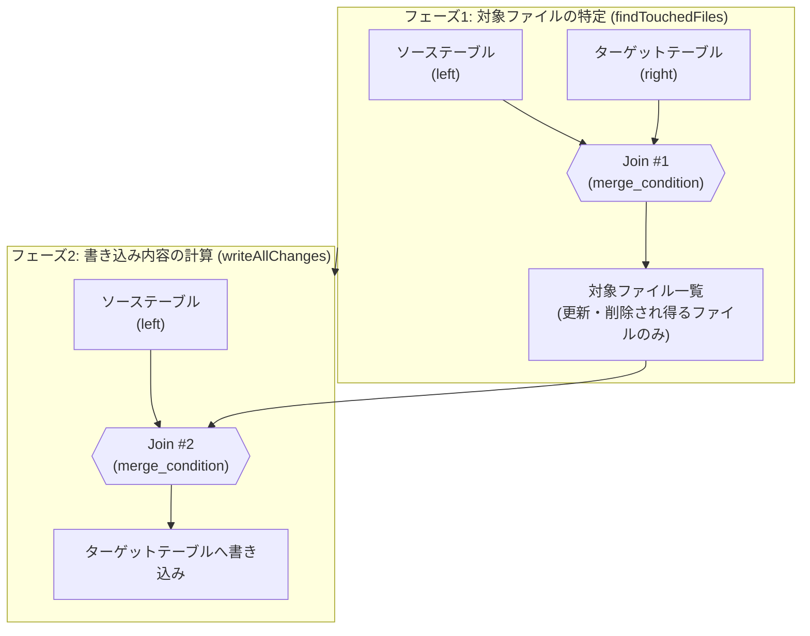
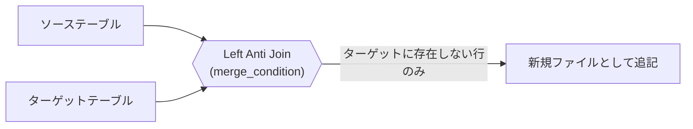

こんにちは、IVRyでデータエンジニアとして働いている松田健司（[@ken_3ba](https://x.com/ken_3ba)）です。
趣味はビリヤードで、プロの試合にも出ているぐらい割とガチでやっています。

先日、青森で開催された「あおもりビリヤードチャリティトーナメント」に参加してきました。
51名が参加する大会で、決勝まで勝ち上がったものの、最後は一歩及ばず準優勝でした。


*あおもりビリヤードチャリティトーナメントの表彰式にて。左が筆者です*

ビリヤードの小話はここまでにして、今回はDelta Lakeの`MERGE INTO`についてお話しします。

Databricksを利用していく上で差分更新をしたいといったときに`MERGE INTO`はDelta Lakeを使ううえで避けて通れない構文です。
簡易に利用できるのですが、内部で何が起きているかを意識せずに使うと、思ったより処理に時間がかかったり、コストがかかったりするといった壁にぶつかります。そして、中の構文は結構複雑だったりして、理解するのはなかなか大変です。

本記事では、Delta LakeのOSSコードを読みながら`MERGE INTO`の内部処理について整理します。

# TL;DR

- `MERGE INTO`は内部的に2段階のジョインとして実行される。フェーズ1でソースとターゲットをジョインして更新・削除され得るファイルを絞り込み、フェーズ2でそのファイルとソースを再ジョインして書き込み内容を計算する。
- ジョイン種別（Inner / Left Outer / Right Outer / Full Outer / Left Anti）は、MERGE文に書かれた`WHEN`句の組み合わせとDeletion Vectors（DV）の有効・無効で決まる。`WHEN NOT MATCHED`のみのInsert-only MERGEは`Left Anti`になり、既存ファイルを一切書き換えない。
- 実際にDatabricks SQLウェアハウス上でサンプルテーブルを使って検証したところ、キーがテーブル全体に散らばったCDC的なソースでMERGEすると、Z-orderしていても90ファイル中90ファイルが丸ごと書き直された。一方、`ON`句にパーティションキーの絞り込み条件を1つ足すだけで、書き直しは90ファイル中1ファイルまで減った。
- 同じ条件でLiquid Clusteringテーブルに対してMERGEすると、既存ファイルは1つも書き直されず、Deletion Vectorで該当行だけ無効化された。パーティション+Z-orderのテーブルでは同じDV有効設定でもDVが使われず全書き直しになっており、Databricks公式ドキュメントの「Low shuffle mergeによるレイアウト保持はbest-effort（保証ではない）」という記述と符合する結果だった。
- 検証に使ったのはあくまでDatabricks SQLウェアハウス経由の`DESCRIBE HISTORY`統計であり、Spark UIのクエリDAGでジョイン種別そのもの（Inner/Left Antiなど）を直接見たわけではない。

# MERGE INTOについて

`MERGE INTO`は、ソース側のデータをキーで突き合わせながらターゲットテーブルを更新する構文です。よくある使いどころは以下のようなケースです。

- **Upsert**: ソースのキーがターゲットに存在すれば更新、存在しなければ挿入する基本パターン
- **CDC・SCDの反映**: 変更データキャプチャ（CDC）で届いた差分を、SCD Type 1（上書き）やType 2（履歴保持）としてターゲットテーブルに反映する

`MERGE`は[他の同時書き込みと競合しやすい操作](https://docs.delta.io/latest/concurrency-control.html)でもあります。`ON`句や`matched_condition`でパーティション列などの絞り込み条件を明示しないと、テーブル全体をスキャンする形になり、他のパーティションを更新する並行処理とも競合しやすくなります。後述する「絞り込み条件を足すとファイルスキップが効く」という話は、パフォーマンスだけでなく同時実行時の競合を避けるという観点でも意味を持ちます。

Databricks SQL / Delta Lakeの`MERGE INTO`は次の構文になります。

```sql
MERGE [ WITH SCHEMA EVOLUTION ] INTO target_table_name [target_alias]
  USING source_table_reference [source_alias]
  ON merge_condition
  { WHEN MATCHED [ AND matched_condition ] THEN matched_action |
    WHEN NOT MATCHED [BY TARGET] [ AND not_matched_condition ] THEN not_matched_action |
    WHEN NOT MATCHED BY SOURCE [ AND not_matched_by_source_condition ] THEN not_matched_by_source_action } [...]
```

`target_table_name`が更新される側のDeltaテーブル（**ターゲットテーブル**）、`USING`句に指定するのが更新内容の元になるテーブル（**ソーステーブル**）です。ソーステーブルはDeltaテーブルである必要はなく、CSVから読み込んだDataFrameやCTE、別形式のテーブルなど、Sparkでクエリできるものであれば何でも指定できます。CDCパイプラインであれば「今回のバッチで届いた変更差分」、Upsertバッチであれば「最新の状態を持つ外部テーブル」がソーステーブルにあたり、`ON merge_condition`で指定したキーでターゲットテーブルの各行と突き合わせて、`WHEN`句に応じた`UPDATE`/`DELETE`/`INSERT`を行います。

3種類の`WHEN`句があり、どれを書くか・書かないかの組み合わせによってMERGEの意味、そして内部で使われるジョイン戦略が変わります。この対応関係は紛らわしいので、次の章で先に整理しておきます。

# MERGE INTOの内部動作の詳細

Delta LakeのOSS実装（[delta-io/delta](https://github.com/delta-io/delta/blob/v3.2.0/spark/src/main/scala/org/apache/spark/sql/delta/commands/MergeIntoCommand.scala)）を見ると、`MERGE INTO`は大きく2つのフェーズで構成されていることが分かります。

## 用語の整理

解説を読み進める前に、混同しやすい用語の対応関係を先に整理しておきます。文中では`source`（ソーステーブル）と`target`（ターゲットテーブル）という言葉が繰り返し出てきます。

| 用語 | 指すもの |
|---|---|
| `source` | 今回のバッチ・差分のデータ |
| `target` | 更新される側のデータ |

内部のコードは一貫して`sourceDF.join(targetDF, condition, joinType)`という書き方をしています。`.join()`を呼ぶ側（ドットの前）が`left`、引数に渡す側が`right`です。つまり`left = source`、`right = target`という対応になります。「`s`ourceは`l`eft、`t`argetは`r`ight」とアルファベットの並びで覚えると混同しにくくなります。

`WHEN`句の名前も紛らわしいので、あわせて整理します。

| 句 | 実際にどの行を指すか | 主なアクション |
|---|---|---|
| `WHEN MATCHED` | sourceとtargetの**両方**に存在する行 | UPDATE / DELETE |
| `WHEN NOT MATCHED`（`BY SOURCE`なし） | **source**にしかない行（新しく届いた行） | INSERT |
| `WHEN NOT MATCHED BY SOURCE` | **target**にしかない行（もう届かなくなった行） | UPDATE / DELETE |

`NOT MATCHED BY SOURCE`は「ソースによってマッチされない」という意味で、主語はtargetの行です。`BY SOURCE`が付いている方が指している行はtarget側にしかない行になる、という点が直感に反して混同しやすいポイントです。「`NOT MATCHED`（無印）はINSERT用の新規行、`BY SOURCE`が付いたらtargetのお片付け用」と覚えておくと区別しやすくなります。

## フェーズで見るMERGE INTOの内部動作

用語が整理できたところで、`MERGE INTO`をおおまかにフェーズで分けて見ていきます。

1. **フェーズ1: 対象ファイルの特定（`findTouchedFiles`）**: ソーステーブルとターゲットテーブルをマージキーでジョインし、更新・削除の対象になり得る**ファイルを特定する**
2. **フェーズ2: 書き込み内容の計算（`writeAllChanges` / `writeDVs`）**: ソーステーブルと、フェーズ1で見つかった対象ファイルを再度ジョインし、**実際に書き込む内容を計算する**

実際のコード（`MergeIntoCommand.scala`）を単純化すると、全体の制御フローはおおよそ次のようになっています。

```scala
// フェーズ1: 対象ファイルの特定
val (filesToRewrite, deduplicateCDFDeletes) = findTouchedFiles(spark, deltaTxn)

if (filesToRewrite.nonEmpty) {
  val shouldWriteDeletionVectors =
    shouldWritePersistentDeletionVectors(spark, deltaTxn)

  if (shouldWriteDeletionVectors) {
    // フェーズ2 (DV有効): 変更行だけを新規ファイルに書き込む
    val newWrittenFiles = writeAllChanges(
      spark, deltaTxn, filesToRewrite,
      deduplicateCDFDeletes, writeUnmodifiedRows = false)

    // 既存ファイル側にDeletion Vectorを書き込む
    val dvActions = writeDVs(spark, deltaTxn, filesToRewrite)

    newWrittenFiles ++ dvActions
  } else {
    // フェーズ2 (DV無効): 未変更行も含めて丸ごと書き直す
    val newWrittenFiles = writeAllChanges(
      spark, deltaTxn, filesToRewrite,
      deduplicateCDFDeletes, writeUnmodifiedRows = true)

    newWrittenFiles ++ filesToRewrite.map(_.remove)
  }
} else {
  // 対象ファイルなし = Insert-onlyの高速パス
  writeOnlyInserts(spark, deltaTxn, ...)
}
```

（実コードを単純化した抜粋です。エラーハンドリングやメトリクス収集など、この記事のテーマに関係しない処理は省略しています）

`writeAllChanges`の`writeUnmodifiedRows`引数に、DVが有効か無効かがそのまま渡っているのが分かります。DV有効なら`false`（未変更行は書かない）、無効なら`true`（丸ごと書き直す）です。DV有効時のみ、`writeAllChanges`とは別に`writeDVs`が呼ばれて既存ファイル側にDeletion Vectorが書き込まれます。

フェーズ1は「どのファイルを読み直す必要があるか」を絞り込むための軽量なジョイン、フェーズ2は実際にデータを書き出すための本番ジョインという役割分担です。ここでファイル単位のデータスキッピングが効くかどうかが、パフォーマンスを大きく左右します。全体像は次のようになります。



<!-- TODO(画像・優先度中): 上記Mermaid図をFigmaの図に差し替える。left/rightどちらがsource/targetか、target/sourceのテーブル→ジョイン→対象ファイル特定の流れが一目でわかる図にする。この後の「フェーズ1のジョイン種別」「フェーズ2のジョイン種別」の各見出し直下にも、それぞれのフェーズだけを抜き出した図を追加するとよい -->

## フェーズ1のジョイン種別

`findTouchedFiles`（`ClassicMergeExecutor.scala`）は、`WHEN NOT MATCHED BY SOURCE`句の有無でジョイン種別を切り替えます。

| 条件 | ジョイン種別 | Z-orderによる事前スキッピング |
|---|---|---|
| `WHEN NOT MATCHED BY SOURCE`句がある | `Right Outer` | 効かない（全ファイルが対象） |
| `WHEN NOT MATCHED BY SOURCE`句がない | `Inner` | 効く（`ON`句のターゲット単独条件で絞り込み） |

なぜ`NOT MATCHED BY SOURCE`句がある場合だけ`Right Outer`になるのか、`sourceDF.join(targetDF, condition, joinType)`という書き方から見てみます。`targetDF`（ターゲット）が`Right`側です。`Right Outer Join`は「右側（ターゲット）の行を、ソース側にマッチするかどうかに関わらず必ず結果に残す」ジョインです。`NOT MATCHED BY SOURCE`はまさに「ソースにマッチしなかったターゲット行」を処理対象にする句なので、`Inner`のままだとそのターゲット行自体がジョイン結果から消えてしまい、処理対象を見つけられません。だから`NOT MATCHED BY SOURCE`句がある場合は`Right Outer`にして、ターゲット側の全行を取りこぼさないようにしています。

そして、このジョイン種別の分岐は、後述する事前のファイルスキッピングが効くかどうかにも直結しています。

実際のコードでは、ジョインの前に「事前のファイル絞り込み」が入っています。ここが検証2で見た「`ON`句に条件を1つ足すと90ファイル→1ファイルに減る」現象の正体です。

```scala
val dataSkippedFiles =
  if (notMatchedBySourceClauses.isEmpty) {
    // ON句のうちターゲット単独で判定できる条件で、Z-order統計を使って絞り込む
    deltaTxn.filterFiles(getTargetOnlyPredicates(spark), keepNumRecords = true)
  } else {
    // 常にtrueの条件を渡す = 実質フィルタなし。全ファイルが対象のまま残る
    deltaTxn.filterFiles(filters = Seq(Literal.TrueLiteral), keepNumRecords = true)
  }

// ジョイン種別の決定: NOT MATCHED BY SOURCE句があるかどうかで切り替わる
val joinType = if (notMatchedBySourceClauses.isEmpty) "inner" else "right_outer"

// sourceDF/targetDFを組み立てて、ON句の条件(condition)でジョイン
val sourceDF = getMergeSource.df
val targetDF = Dataset.ofRows(spark, targetPlan) // targetPlanはdataSkippedFilesだけを読む

val joinToFindTouchedFiles =
  sourceDF.join(targetDF, Column(condition), joinType)
```

（実コードを単純化した抜粋です。列の付与やメトリクス計測など、この記事のテーマに関係しない処理は省略しています）

`notMatchedBySourceClauses.isEmpty`のときだけ、`getTargetOnlyPredicates(spark)`（`ON`句のうちターゲット単独で評価できる条件、例えば`t.event_date = DATE'2026-01-05'`）を使って`deltaTxn.filterFiles`が呼ばれ、Z-orderのmin/max統計によるファイルプルーニングがここで行われます。`NOT MATCHED BY SOURCE`句があると、ターゲット側だけの行（ソースにマッチしない行）も処理対象に含める必要があるため、事前にファイルを除外できず`Literal.TrueLiteral`（全ファイル対象）になります。`targetPlan`はこの`dataSkippedFiles`で絞り込まれた後のファイルだけを読むように組まれているので、ジョインそのものよりも前の「事前の絞り込み」の段階で、対象ファイル数がほぼ決まってしまうということです。

### 具体例で見るフェーズ1

target（既存2行）とsource（今回のバッチ2行）で、以下のデータを例にします。

| target.user_id | status |
|---|---|
| 1 | active |
| 3 | active |

| source.user_id | status |
|---|---|
| 1 | updated |
| 2 | new |

`user_id=1`はtarget・source両方に存在（MATCHED）、`user_id=2`はsourceにしかない（NOT MATCHED）、`user_id=3`はtargetにしかない（NOT MATCHED BY SOURCE）行です。

**`WHEN NOT MATCHED BY SOURCE`句がない場合（`joinType = inner`）**

```sql
WHEN MATCHED THEN UPDATE ...
WHEN NOT MATCHED THEN INSERT ...
```

| user_id | ジョイン結果 |
|---|---|
| 1 | 残る（MATCHED、対象ファイルとして記録） |
| 2 | 結果に出ない（後述する特殊ケースで別処理） |
| 3 | 結果に出ない（`NOT MATCHED BY SOURCE`句がないので処理不要） |

`Inner`なので、sourceにマッチしなかった`user_id=3`はそもそもジョイン結果に現れません。「処理しなくていい行」を最初から持たずに済みます。

**`WHEN NOT MATCHED BY SOURCE`句がある場合（`joinType = right_outer`）**

```sql
WHEN MATCHED THEN UPDATE ...
WHEN NOT MATCHED BY SOURCE THEN UPDATE SET status = 'inactive'
```

| user_id | ジョイン結果 |
|---|---|
| 1 | 残る（MATCHED、対象ファイルとして記録） |
| 3 | 残る（NOT MATCHED BY SOURCE、source側の列は全部NULL、それでも対象ファイルとして記録） |

`Right Outer`なので、targetの全行（`user_id=3`含む）を取りこぼしません。ここで`NOT MATCHED BY SOURCE`句を処理対象にできる代わり、事前のZ-orderスキッピングも効かなくなります（全ファイルが候補になる）。

<!-- TODO(画像・優先度高): target 1,3 / source 1,2 のベン図的な図。MATCHED/NOT MATCHED/NOT MATCHED BY SOURCEの重なりを視覚化し、Inner/Right Outerでどの行が結果に残るかを一目でわかるようにする -->

## フェーズ2：DV無効とDV有効で何が根本的に違うか

フェーズ2のジョイン種別に入る前に、DV（Deletion Vectors）の有無で書き込み方がどう変わるかを整理します。Deltaのファイルは一度書いたら中身を直接書き換えられません。1行だけ`UPDATE`したいときも、選択肢は次の2つしかありません。

- **DV無効（Copy-on-Write）**: 対象ファイルを丸ごと新しいファイルとして書き直す。変更したい行だけでなく、そのファイルに入っている変更しない行も全部一緒にコピーして新ファイルに書く。元ファイルは削除
- **DV有効**: 元のファイルはそのまま残す。変更した行だけを新しい小さなファイルに書き、元ファイルには「この行はもう無効」という印（Deletion Vector）を別ファイルとして追加する。公式ドキュメントはこれを「soft-delete」と呼んでいます

未変更行を「新ファイルにコピーする対象」として持つ必要があるかどうかが、そのままジョイン種別の広さに直結します。DV無効は未変更行もジョイン結果に含める必要があるためジョインが広め（`Right Outer`/`Full Outer`）になり、DV有効は変更対象の行だけに絞れるため狭いジョイン（`Inner`が使えるケースもある）で済みます。

<!-- TODO(画像・優先度高): DV無効(ファイルを丸ごとコピーして書き直す)とDV有効(元ファイルは残し、差分だけ新規ファイル+DVファイルで管理する)の模式図。旧ファイル・新ファイル・DVファイルを箱で表し、矢印で書き込みの流れを示す -->

## フェーズ2のジョイン種別

**DVが無効の場合**

| 条件 | ジョイン種別 |
|---|---|
| `WHEN MATCHED`句しかない | `Right Outer` |
| それ以外（`NOT MATCHED`や`NOT MATCHED BY SOURCE`を含む） | `Full Outer` |

DV無効時は更新対象外の行も含めてジョイン結果をそのまま書き込む必要があるため、`Inner`にはなりません。`WHEN MATCHED`句しかない場合でも、ターゲット側の行を漏れなく出力するために`Right Outer`が使われます。ジョインした結果をそのままターゲットテーブルに書き込む、つまり該当ファイルを丸ごと書き直すCopy-on-Write方式です。

### 具体例で見るフェーズ2（DV無効）

先ほどと同じtarget（`user_id=1,3`）・source（`user_id=1,2`）で見ます。

**`WHEN MATCHED`句しかない場合（`joinType = rightOuter`）**

```sql
WHEN MATCHED THEN UPDATE SET status = s.status
```

| user_id | ジョイン結果 | 最終的な出力 |
|---|---|---|
| 1 | 残る（MATCHED） | `status='updated'` |
| 3 | 残る（未変更） | 該当する`WHEN`句がないのでそのままコピー |

ポイントは、`joinType`が決めているのは「どの行がジョイン結果に残るか」だけで、残った行に何のアクションを適用するかは別のロジック（`SOURCE_ROW_PRESENT_COL`/`TARGET_ROW_PRESENT_COL`のNULL判定）で決まるという点です。`user_id=1`はInnerでもRight Outerでも同じように`UPDATE`が適用されます。`Right Outer`にしたことで増えるのは、未変更行`user_id=3`までジョイン結果に含まれることだけです。この未変更行が「該当する`WHEN`句がないのでそのままコピー」としてまとめて書き直されるのが、DV無効時に「ファイル全体を書き直す」動作の正体です。

**DVが有効の場合**

| 条件 | ジョイン種別 |
|---|---|
| `WHEN MATCHED`句しかない | `Inner` |
| `WHEN NOT MATCHED BY SOURCE`句がない | `Left Outer` |
| `WHEN NOT MATCHED`句がない | `Right Outer` |
| それ以外（全ての節がある） | `Full Outer` |

書き込みは2つに分かれます。新規・更新後のデータは新規ファイルに書き込み、更新・削除された「事実」は既存ファイルを書き直さずに新規のDVファイル（該当ファイル内のどの行が無効化されたかを記録するサイドカーファイル）に書き込みます。既存ファイルをコピーし直す必要がなくなるため、書き込みコストを大きく削減できます。

### 具体例で見るフェーズ2（DV有効）

同じtarget・sourceで、DVが有効な場合の4パターンを見ます。

**`isMatchedOnly`（`WHEN MATCHED`句のみ、`joinType = inner`）**

```sql
WHEN MATCHED THEN UPDATE SET status = s.status
```

| user_id | ジョイン結果 | 出力 |
|---|---|---|
| 1 | 残る（MATCHED） | `status='updated'`（新規の小さなファイルへ） |
| 3 | 結果に出ない | 一切触らない。既存ファイルはそのまま、DVも立たない |

`Inner`なので、変更対象の`user_id=1`しかジョイン結果に出てきません。未変更の`user_id=3`はそもそも結果に含まれず、既存ファイルもDVも触られません。「3はそのまま放置、1だけ直す」がそのまま体現された形です。

**`WHEN NOT MATCHED BY SOURCE`句がない場合（`joinType = leftOuter`）**

```sql
WHEN MATCHED THEN UPDATE ...
WHEN NOT MATCHED THEN INSERT ...
```

| user_id | ジョイン結果 | 出力 |
|---|---|---|
| 1 | 残る（MATCHED） | `UPDATE`の結果 |
| 2 | 残る（NOT MATCHED） | `INSERT`の結果（新規行） |
| 3 | 結果に出ない | `NOT MATCHED BY SOURCE`句がないので処理不要 |

`Left Outer`はsource側（left）を主体に、source全行を残すジョインです。sourceにない`user_id=3`はそもそも処理対象でないため、Innerの時点で落ちます。

**`WHEN NOT MATCHED`句がない場合（`joinType = rightOuter`）**

```sql
WHEN MATCHED THEN UPDATE ...
WHEN NOT MATCHED BY SOURCE THEN UPDATE SET status = 'inactive'
```

| user_id | ジョイン結果 | 出力 |
|---|---|---|
| 1 | 残る（MATCHED） | `UPDATE`の結果 |
| 3 | 残る（NOT MATCHED BY SOURCE） | `status='inactive'` |
| 2 | 結果に出ない | `NOT MATCHED`句がないのでINSERTしない |

`Right Outer`はtarget側（right）を主体に、target全行を残すジョインです。sourceにしかない`user_id=2`はINSERTしないので不要、Innerの時点で落ちます。

**全種類の`WHEN`句がある場合（`joinType = fullOuter`）**

```sql
WHEN MATCHED THEN UPDATE ...
WHEN NOT MATCHED THEN INSERT ...
WHEN NOT MATCHED BY SOURCE THEN UPDATE SET status = 'inactive'
```

| user_id | ジョイン結果 | 出力 |
|---|---|---|
| 1 | 残る（MATCHED） | `UPDATE`の結果 |
| 2 | 残る（NOT MATCHED） | `INSERT`の結果（新規行） |
| 3 | 残る（NOT MATCHED BY SOURCE） | `status='inactive'` |

3パターン全部が処理対象を持つため、`Full Outer`で3行すべてがジョイン結果に残ります。

## 特殊ケース：Insert-only MERGE

`WHEN NOT MATCHED THEN INSERT`だけを持つMERGE（重複行があれば無視して新規行だけ追加する、CDC/Upsertでよくあるパターン）は特別扱いされます。フェーズ1のジョインは`Left Anti`になり、「ソースにあってターゲットにない行」を直接抽出します。既存ファイルを一切書き換える必要がないため、単純な追記（append）で完結します。



この特殊ケースは、後述の実測検証で実際に裏付けが取れました。

<!-- TODO(画像・優先度低): 上記Mermaid図をFigmaの図に差し替える -->

# 実測検証：analysis-stgでサンプルテーブルを作って確かめる

ここからは、Databricksの検証用ワークスペース（analysis-stg）にサンプルテーブルを作成し、`MERGE INTO`を実際に実行して`DESCRIBE HISTORY`のoperationMetricsで挙動を確認します。

検証環境の制約として、今回はDatabricks SQLウェアハウス経由でクエリを実行しています。`EXPLAIN FORMATTED`では`MergeIntoCommandEdge`という1つのコマンドノードしか見えず、内部のジョイン種別（Inner/Left Antiなど）を直接見ることはできませんでした。ジョイン種別そのものを見るにはSpark UIのクエリDAGが必要です。そのため、この検証では「実際に何ファイル読み書きされたか」という`operationMetrics`の実測値をもとに、OSSコードの記述と整合するかどうかを確認する形を取っています。

## テーブル構成

CDC由来のソースデータのように、更新対象のキーがテーブル全体に散らばっている状況を再現するため、以下の2つのターゲットテーブルを用意しました。

```sql
-- パーティション + Z-order
CREATE TABLE merge_demo_target_partition (
  user_id BIGINT,
  event_date DATE,
  status STRING,
  updated_at TIMESTAMP
)
USING DELTA
PARTITIONED BY (event_date);

-- Liquid Clustering
CREATE TABLE merge_demo_target_liquid (
  user_id BIGINT,
  event_date DATE,
  status STRING,
  updated_at TIMESTAMP
)
USING DELTA
CLUSTER BY (user_id);
```

各テーブルに`user_id`が0〜300万の300万行を5バッチに分けて投入し（1バッチごとにキー範囲が全体に及ぶようにして、実際のCDCバッチに近い状態を作った）、パーティション版は`OPTIMIZE ... ZORDER BY (user_id)`で90ファイル（日付パーティションごとに1ファイル）に整理しました。

ソース側は、`user_id`をテーブル全体に一様に分散させた3万行のCDCバッチを用意しました。

```sql
CREATE TABLE merge_demo_source_cdc AS
SELECT
  (id * 97) % 3000000 AS user_id,
  date_add(DATE'2026-01-01', CAST(((id * 97) % 3000000) % 90 AS INT)) AS event_date,
  'updated' AS status,
  timestamp'2026-02-01 00:00:00' AS updated_at
FROM range(0, 30000) AS t(id);
```

## 検証1: 全域に散らばったキーでのMERGE

まず素直に`WHEN MATCHED`のみのUPDATE MERGEを実行しました。

```sql
MERGE INTO merge_demo_target_partition AS t
USING merge_demo_source_cdc AS s
ON t.user_id = s.user_id
WHEN MATCHED THEN UPDATE SET t.status = s.status, t.updated_at = s.updated_at
```

`DESCRIBE HISTORY`で取得した`operationMetrics`は以下の通りです。

| メトリクス | 値 |
|---|---|
| numTargetFilesRemoved | 90（全ファイル） |
| numTargetFilesAdded | 90 |
| numTargetRowsCopied | 2,970,000（更新対象外の行も含め全行） |
| numTargetDeletionVectorsAdded | 0 |
| scanTimeMs / rewriteTimeMs | 1,038 / 3,072 |

対象テーブルは90ファイルしかないのに、90ファイル全てが書き直されました。マージキーでZ-orderしていても、更新対象の3万行がほぼ全ての日付パーティションに1件以上含まれてしまうため、min/max統計によるファイルスキップがまったく効いていません。

Z-order（データスキッピング）は、ファイルのmin/max統計とクエリ側の絞り込み条件を突き合わせて「絶対にマッチしないファイル」を読み飛ばす仕組みです。ところが`MERGE INTO`はデフォルトでソーステーブル全体をジョインの一方の入力として扱うため、絞り込み条件として機能するのは実質「ソーステーブルに含まれるキーの範囲全体」になります。今回のようにソースのキーがテーブル全体に一様分布していると、ターゲット側のほぼ全ファイルのmin/max範囲とソース側の範囲が重なってしまい、Z-orderでファイル内の並びをどれだけ整えても、ファイル単位でスキップできる余地がほぼゼロになります。

## 検証2: ON句への絞り込み条件の追加

同じテーブルに対して、今度は`event_date`が1日分だけに絞られた300行のソースで、`ON`句にパーティション列の条件を明示的に加えてMERGEしました。

```sql
MERGE INTO merge_demo_target_partition AS t
USING merge_demo_source_narrow AS s
ON t.user_id = s.user_id AND t.event_date = DATE'2026-01-05'
WHEN MATCHED THEN UPDATE SET t.status = s.status, t.updated_at = s.updated_at
```

| メトリクス | 絞り込みなし | 絞り込みあり |
|---|---|---|
| numTargetFilesRemoved | 90 | 1 |
| numTargetFilesAdded | 90 | 1 |
| numTargetRowsCopied | 2,970,000 | 33,034 |
| executionTimeMs | 4,135 | 2,139 |

`ON`句に`t.event_date = DATE'2026-01-05'`という1条件を足しただけで、書き直し対象は90ファイルから1ファイルに減りました。`matched_condition`/`not_matched_condition`でジョイン対象を絞るというよく知られた高速化アプローチと同じ効果を、実測で確認できたことになります。Z-orderそのものが無意味なのではなく、ソース側の絞り込み条件がキー範囲全体をカバーしてしまっている限り、ファイル単位のプルーニングは効きようがない、という理屈が実データでも成立していました。

## 検証3: Insert-only MERGEでの書き込み範囲

`WHEN NOT MATCHED THEN INSERT`のみのMERGEも試しました。ソースは既存にない新規`user_id`を1万件用意したものです。

```sql
MERGE INTO merge_demo_target_partition AS t
USING merge_demo_source_new AS s
ON t.user_id = s.user_id
WHEN NOT MATCHED THEN INSERT (user_id, event_date, status, updated_at)
VALUES (s.user_id, s.event_date, s.status, s.updated_at)
```

| メトリクス | 値 |
|---|---|
| numTargetFilesRemoved | 0 |
| numTargetFilesAdded | 90（新規ファイルのみ） |
| numTargetRowsCopied | 0 |
| numTargetRowsInserted | 10,000 |

既存の90ファイルには一切手を付けず、新規ファイルだけが追加されました。OSSコードの記述通り、Insert-only MERGEは`Left Anti`ジョインによる単純な追記として処理されていることが、実測の`operationMetrics`からも確認できます。CDC的なUpsertパイプラインで「新規行の取り込みだけ」を目的にしたジョブがこのパターンに当てはまっていれば、既存データの書き直しコストを気にする必要がないということです。

## 検証4: Liquid Clusteringでの同一MERGE

最後に、`CLUSTER BY (user_id)`を指定したLiquid Clusteringテーブルに対して、検証1と全く同じCDCソース・同じMERGE文を実行しました。

```sql
MERGE INTO merge_demo_target_liquid AS t
USING merge_demo_source_cdc AS s
ON t.user_id = s.user_id
WHEN MATCHED THEN UPDATE SET t.status = s.status, t.updated_at = s.updated_at
```

| メトリクス | partition + Z-order | Liquid Clustering |
|---|---|---|
| numTargetFilesRemoved | 90 | 0 |
| numTargetFilesAdded | 90 | 1 |
| numTargetRowsCopied | 2,970,000 | 0 |
| numTargetDeletionVectorsAdded | 0 | 5 |
| numTargetBytesAdded | 6,093,263 | 145,325 |

どちらのテーブルも`delta.enableDeletionVectors = true`が設定された状態でしたが、結果は対照的でした。パーティション+Z-orderのテーブルはDVを使わず全ファイルを書き直したのに対し、Liquid Clusteringのテーブルは既存ファイルを1つも書き直さず、更新行だけを新規ファイルに書き、元のファイル側は5件のDeletion Vectorで該当行を無効化するだけで済んでいます。書き込みバイト数も約42分の1でした。

<!-- TODO(画像・優先度低): partition+zorder(全ファイル書き直し)とliquid clustering(既存ファイル温存+DV追加)の結果を、ファイルの模式図で対比。灰色=既存ファイルそのまま、オレンジ=新規書き込み、のような色分けで一目で差がわかるようにする -->

なぜこの差が出たのかを確認するため、Databricksの公式ドキュメントを調べましたが、この挙動差を断定的に説明する記述は見つかりませんでした。最も近い記述は[Low shuffle merge](https://learn.microsoft.com/en-us/azure/databricks/optimizations/low-shuffle-merge)のドキュメントにあり、「Low shuffle mergeは変更されなかった行の既存データレイアウト（Liquid ClusteringやZ-orderのレイアウトを含む）をbest-effortで保持する」と明記されています。つまり既存レイアウトの保持もDVの適用も「保証」ではなく「best-effort」の最適化です。今回はパーティション内の全ファイルに更新対象行が1件以上含まれる状況だったため、Z-order側ではこのbest-effortな最適化が効かなかった、という理解にとどめておくのが正直なところです。この差の正確な内部条件を突き止めるには、Spark UIのクエリDAGでジョインプランを直接確認する必要があり、今回のSQLウェアハウス経由の検証では踏み込めていません。

# まとめ

- `MERGE INTO`は「対象ファイルを絞り込むジョイン」→「書き込み内容を計算するジョインと書き込み」の2フェーズ構成。ジョイン種別は`WHEN`句の組み合わせとDVの有効・無効で機械的に決まる。
- Insert-only MERGEは`Left Anti`ジョインになり、既存ファイルを一切書き換えない。実測でも`numTargetFilesRemoved: 0`として確認できた。
- Z-orderは「ソース側の絞り込み条件が狭い」ことを前提にした最適化。CDC由来のようにキーがテーブル全体に散らばったソースでMERGEすると、ファイルスキップはほぼ効かない。実測では90ファイル中90ファイルが書き直された。
- `ON`句にパーティション列などの絞り込み条件を明示的に加えるだけで、書き直し対象を大きく減らせる（今回の実測では90ファイル→1ファイル）。
- Liquid Clusteringは同じUPDATE MERGEでも既存ファイルを書き直さずDVで完結する場合があった一方、パーティション+Z-orderでは同じDV設定でも全書き直しになった。この差を公式ドキュメントは「best-effort」としか説明しておらず、断定的な条件は不明。気になる場合はSpark UIのクエリDAGで実際のジョインプランを確認するのが確実。

# 参考リンク

- [delta-io/delta: MergeIntoCommand.scala (v3.2.0)](https://github.com/delta-io/delta/blob/v3.2.0/spark/src/main/scala/org/apache/spark/sql/delta/commands/MergeIntoCommand.scala)
- [Diving Into Delta Lake: DML Internals (Update, Delete, Merge) - Databricks Blog](https://www.databricks.com/blog/2020/09/29/diving-into-delta-lake-dml-internals-update-delete-merge.html)
- [Faster MERGE Performance With Low-Shuffle Merge and Photon - Databricks Blog](https://www.databricks.com/blog/faster-merge-performance-low-shuffle-merge-and-photon)
- [Low shuffle merge on Databricks](https://learn.microsoft.com/en-us/azure/databricks/optimizations/low-shuffle-merge)
- [Deletion vectors in Databricks](https://docs.databricks.com/aws/en/delta/deletion-vectors)
- [What are deletion vectors? - Delta Lake](https://docs.delta.io/latest/delta-deletion-vectors.html)
- [MERGE INTO - Databricks SQL言語リファレンス](https://docs.databricks.com/en/sql/language-manual/delta-merge-into.html)
- [Concurrency control - Delta Lake](https://docs.delta.io/latest/concurrency-control.html)
