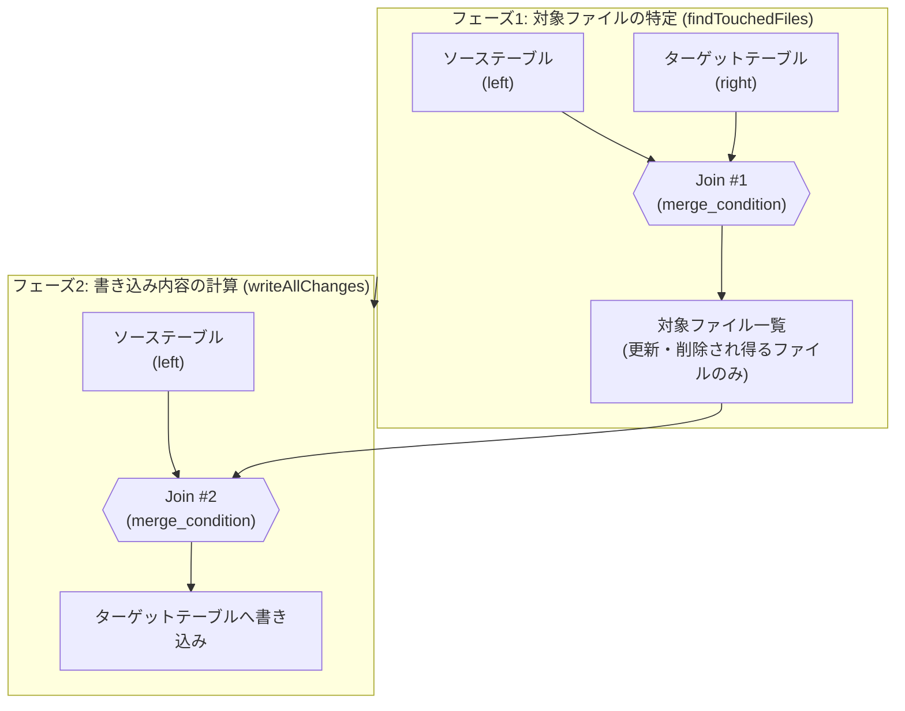
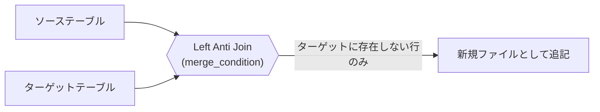

こんにちは、IVRyでデータエンジニアとして働いている松田健司（[@ken_3ba](https://x.com/ken_3ba)）です。趣味はビリヤードで、プロの試合にも出ているぐらい割とガチでやっています。

先日、弘前市で開催された「あおもりビリヤードチャリティトーナメント」に参加してきました。51名が参加する大会で、決勝まで勝ち上がったものの、最後は一歩及ばず準優勝でした。悔しい結果でしたが、良い経験になりました。


*あおもりビリヤードチャリティトーナメントの表彰式にて。左が筆者です*

ビリヤードの小話はここまでにして、本題のDelta Lakeの`MERGE INTO`についてお話しします。

`MERGE INTO`はDelta Lakeを使ううえで避けて通れない構文ですが、内部で何が起きているかを意識せずに使うと、思ったよりコストが高い・思ったより速くならないといった壁にぶつかります。本記事では、Delta LakeのOSSコードを読みながら`MERGE INTO`の内部ジョイン戦略を整理し、さらにDatabricks SQLウェアハウス上でサンプルテーブルを作って実際に`DESCRIBE HISTORY`のoperationMetricsを取得し、パーティション+Z-orderとLiquid Clusteringで挙動がどう変わるかを検証しました。

# TL;DR

- `MERGE INTO`は内部的に2段階のジョインとして実行される。フェーズ1でソースとターゲットをジョインして更新・削除され得るファイルを絞り込み、フェーズ2でそのファイルとソースを再ジョインして書き込み内容を計算する。
- ジョイン種別（Inner / Left Outer / Right Outer / Full Outer / Left Anti）は、MERGE文に書かれた`WHEN`句の組み合わせとDeletion Vectors（DV）の有効・無効で決まる。`WHEN NOT MATCHED`のみのInsert-only MERGEは`Left Anti`になり、既存ファイルを一切書き換えない。
- 実際にDatabricks SQLウェアハウス上でサンプルテーブルを使って検証したところ、キーがテーブル全体に散らばったCDC的なソースでMERGEすると、Z-orderしていても90ファイル中90ファイルが丸ごと書き直された。一方、`ON`句にパーティションキーの絞り込み条件を1つ足すだけで、書き直しは90ファイル中1ファイルまで減った。
- 同じ条件でLiquid Clusteringテーブルに対してMERGEすると、既存ファイルは1つも書き直されず、Deletion Vectorで該当行だけ無効化された。パーティション+Z-orderのテーブルでは同じDV有効設定でもDVが使われず全書き直しになっており、Databricks公式ドキュメントの「Low shuffle mergeによるレイアウト保持はbest-effort（保証ではない）」という記述と符合する結果だった。
- 検証に使ったのはあくまでDatabricks SQLウェアハウス経由の`DESCRIBE HISTORY`統計であり、Spark UIのクエリDAGでジョイン種別そのもの（Inner/Left Antiなど）を直接見たわけではない。

# MERGE INTOの構文とWHEN句

Databricks SQL / Delta Lakeの`MERGE INTO`は次の構文を取ります。

```sql
MERGE [ WITH SCHEMA EVOLUTION ] INTO target_table_name [target_alias]
  USING source_table_reference [source_alias]
  ON merge_condition
  { WHEN MATCHED [ AND matched_condition ] THEN matched_action |
    WHEN NOT MATCHED [BY TARGET] [ AND not_matched_condition ] THEN not_matched_action |
    WHEN NOT MATCHED BY SOURCE [ AND not_matched_by_source_condition ] THEN not_matched_by_source_action } [...]
```

3種類の`WHEN`句があり、どれを書くか・書かないかの組み合わせによってMERGEの意味、そして内部で使われるジョイン戦略が変わります。

| 句 | 意味 |
|---|---|
| `WHEN MATCHED` | マージキーが両方のテーブルに存在する行に対する`UPDATE`/`DELETE` |
| `WHEN NOT MATCHED [BY TARGET]` | ソースにしか存在しない行に対する`INSERT` |
| `WHEN NOT MATCHED BY SOURCE` | ターゲットにしか存在しない行に対する`UPDATE`/`DELETE` |

# OSSコードで見るMERGE INTOの内部動作

Delta LakeのOSS実装（[delta-io/delta](https://github.com/delta-io/delta/blob/v3.2.0/spark/src/main/scala/org/apache/spark/sql/delta/commands/MergeIntoCommand.scala)）を見ると、`MERGE INTO`は大きく2つのフェーズで構成されていることが分かります。

1. **フェーズ1（`findTouchedFiles`）**: ソーステーブルとターゲットテーブルをマージキーでジョインし、更新・削除の対象になり得るファイルを特定する
2. **フェーズ2（`writeAllChanges` / `writeInsertsOnlyWhenNoMatchedClauses`）**: ソーステーブルと、フェーズ1で見つかった対象ファイルを再度ジョインし、実際に書き込む内容を計算する



フェーズ1は「どのファイルを読み直す必要があるか」を絞り込むための軽量なジョイン、フェーズ2は実際にデータを書き出すための本番ジョインという役割分担です。ここでファイル単位のデータスキッピング（min/max統計によるプルーニング）が効くかどうかが、パフォーマンスを大きく左右します。

## フェーズ1のジョイン種別

`MergeIntoCommand.scala`の`findTouchedFiles`は、`WHEN NOT MATCHED BY SOURCE`句の有無でジョイン種別を切り替えます。

| 条件 | ジョイン種別 |
|---|---|
| `WHEN NOT MATCHED BY SOURCE`句がある | `Right Outer` |
| `WHEN NOT MATCHED BY SOURCE`句がない | `Inner` |

`NOT MATCHED BY SOURCE`はターゲット側にしか存在しない行を扱う句なので、それを拾うためにターゲット側を主体にしたOuter Joinが必要になります。

## フェーズ2のジョイン種別

**DVが無効の場合**

| 条件 | ジョイン種別 |
|---|---|
| `WHEN MATCHED`句しかない | `Inner` |
| それ以外（`NOT MATCHED`や`NOT MATCHED BY SOURCE`を含む） | `Full Outer` |

ジョインした結果をそのままターゲットテーブルに書き込みます。つまり該当ファイルを丸ごと書き直すCopy-on-Write方式です。

**DVが有効の場合**

| 条件 | ジョイン種別 |
|---|---|
| `WHEN MATCHED`句しかない | `Inner` |
| `WHEN NOT MATCHED BY SOURCE`句がない | `Left Outer` |
| `WHEN NOT MATCHED`句がない | `Right Outer` |
| それ以外（全ての節がある） | `Full Outer` |

書き込みは2つに分かれます。新規・更新後のデータは新規ファイルに書き込み、更新・削除された「事実」は既存ファイルを書き直さずに新規のDVファイル（該当ファイル内のどの行が無効化されたかを記録するサイドカーファイル）に書き込みます。既存ファイルをコピーし直す必要がなくなるため、書き込みコストを大きく削減できます。

## 特殊ケース：Insert-only MERGE

`WHEN NOT MATCHED THEN INSERT`だけを持つMERGE（重複行があれば無視して新規行だけ追加する、CDC/Upsertでよくあるパターン）は特別扱いされます。フェーズ1のジョインは`Left Anti`になり、「ソースにあってターゲットにない行」を直接抽出します。既存ファイルを一切書き換える必要がないため、単純な追記（append）で完結します。



この特殊ケースは、後述の実測検証で実際に裏付けが取れました。

# 実測検証：analysis-stgでサンプルテーブルを作って確かめる

ここからは、Databricksの検証用ワークスペース（analysis-stg）にサンプルテーブルを作成し、`MERGE INTO`を実際に実行して`DESCRIBE HISTORY`のoperationMetricsで挙動を確認します。

検証環境の制約として、今回はDatabricks SQLウェアハウス経由でクエリを実行しています。`EXPLAIN FORMATTED`では`MergeIntoCommandEdge`という1つのコマンドノードしか見えず、内部のジョイン種別（Inner/Left Antiなど）を直接見ることはできませんでした。ジョイン種別そのものを見るにはSpark UIのクエリDAGが必要です。そのため、この検証では「実際に何ファイル読み書きされたか」という`operationMetrics`の実測値をもとに、OSSコードの記述と整合するかどうかを確認する形を取っています。

## テーブル構成

CDC由来のソースデータのように、更新対象のキーがテーブル全体に散らばっている状況を再現するため、以下の2つのターゲットテーブルを用意しました。

```sql
-- パーティション + Z-order
CREATE TABLE merge_demo_target_partition (
  user_id BIGINT,
  event_date DATE,
  status STRING,
  updated_at TIMESTAMP
)
USING DELTA
PARTITIONED BY (event_date);

-- Liquid Clustering
CREATE TABLE merge_demo_target_liquid (
  user_id BIGINT,
  event_date DATE,
  status STRING,
  updated_at TIMESTAMP
)
USING DELTA
CLUSTER BY (user_id);
```

各テーブルに`user_id`が0〜300万の300万行を5バッチに分けて投入し（1バッチごとにキー範囲が全体に及ぶようにして、実際のCDCバッチに近い状態を作った）、パーティション版は`OPTIMIZE ... ZORDER BY (user_id)`で90ファイル（日付パーティションごとに1ファイル）に整理しました。

ソース側は、`user_id`をテーブル全体に一様に分散させた3万行のCDCバッチを用意しました。

```sql
CREATE TABLE merge_demo_source_cdc AS
SELECT
  (id * 97) % 3000000 AS user_id,
  date_add(DATE'2026-01-01', CAST(((id * 97) % 3000000) % 90 AS INT)) AS event_date,
  'updated' AS status,
  timestamp'2026-02-01 00:00:00' AS updated_at
FROM range(0, 30000) AS t(id);
```

## 検証1: 全域に散らばったキーでのMERGE

まず素直に`WHEN MATCHED`のみのUPDATE MERGEを実行しました。

```sql
MERGE INTO merge_demo_target_partition AS t
USING merge_demo_source_cdc AS s
ON t.user_id = s.user_id
WHEN MATCHED THEN UPDATE SET t.status = s.status, t.updated_at = s.updated_at
```

`DESCRIBE HISTORY`で取得した`operationMetrics`は以下の通りです。

| メトリクス | 値 |
|---|---|
| numTargetFilesRemoved | 90（全ファイル） |
| numTargetFilesAdded | 90 |
| numTargetRowsCopied | 2,970,000（更新対象外の行も含め全行） |
| numTargetDeletionVectorsAdded | 0 |
| scanTimeMs / rewriteTimeMs | 1,038 / 3,072 |

対象テーブルは90ファイルしかないのに、90ファイル全てが書き直されました。マージキーでZ-orderしていても、更新対象の3万行がほぼ全ての日付パーティションに1件以上含まれてしまうため、min/max統計によるファイルスキップがまったく効いていません。

Z-order（データスキッピング）は、ファイルのmin/max統計とクエリ側の絞り込み条件を突き合わせて「絶対にマッチしないファイル」を読み飛ばす仕組みです。ところが`MERGE INTO`はデフォルトでソーステーブル全体をジョインの一方の入力として扱うため、絞り込み条件として機能するのは実質「ソーステーブルに含まれるキーの範囲全体」になります。今回のようにソースのキーがテーブル全体に一様分布していると、ターゲット側のほぼ全ファイルのmin/max範囲とソース側の範囲が重なってしまい、Z-orderでファイル内の並びをどれだけ整えても、ファイル単位でスキップできる余地がほぼゼロになります。

## 検証2: ON句への絞り込み条件の追加

同じテーブルに対して、今度は`event_date`が1日分だけに絞られた300行のソースで、`ON`句にパーティション列の条件を明示的に加えてMERGEしました。

```sql
MERGE INTO merge_demo_target_partition AS t
USING merge_demo_source_narrow AS s
ON t.user_id = s.user_id AND t.event_date = DATE'2026-01-05'
WHEN MATCHED THEN UPDATE SET t.status = s.status, t.updated_at = s.updated_at
```

| メトリクス | 絞り込みなし | 絞り込みあり |
|---|---|---|
| numTargetFilesRemoved | 90 | 1 |
| numTargetFilesAdded | 90 | 1 |
| numTargetRowsCopied | 2,970,000 | 33,034 |
| executionTimeMs | 4,135 | 2,139 |

`ON`句に`t.event_date = DATE'2026-01-05'`という1条件を足しただけで、書き直し対象は90ファイルから1ファイルに減りました。`matched_condition`/`not_matched_condition`でジョイン対象を絞るというよく知られた高速化アプローチと同じ効果を、実測で確認できたことになります。Z-orderそのものが無意味なのではなく、ソース側の絞り込み条件がキー範囲全体をカバーしてしまっている限り、ファイル単位のプルーニングは効きようがない、という理屈が実データでも成立していました。

## 検証3: Insert-only MERGEでの書き込み範囲

`WHEN NOT MATCHED THEN INSERT`のみのMERGEも試しました。ソースは既存にない新規`user_id`を1万件用意したものです。

```sql
MERGE INTO merge_demo_target_partition AS t
USING merge_demo_source_new AS s
ON t.user_id = s.user_id
WHEN NOT MATCHED THEN INSERT (user_id, event_date, status, updated_at)
VALUES (s.user_id, s.event_date, s.status, s.updated_at)
```

| メトリクス | 値 |
|---|---|
| numTargetFilesRemoved | 0 |
| numTargetFilesAdded | 90（新規ファイルのみ） |
| numTargetRowsCopied | 0 |
| numTargetRowsInserted | 10,000 |

既存の90ファイルには一切手を付けず、新規ファイルだけが追加されました。OSSコードの記述通り、Insert-only MERGEは`Left Anti`ジョインによる単純な追記として処理されていることが、実測の`operationMetrics`からも確認できます。CDC的なUpsertパイプラインで「新規行の取り込みだけ」を目的にしたジョブがこのパターンに当てはまっていれば、既存データの書き直しコストを気にする必要がないということです。

## 検証4: Liquid Clusteringでの同一MERGE

最後に、`CLUSTER BY (user_id)`を指定したLiquid Clusteringテーブルに対して、検証1と全く同じCDCソース・同じMERGE文を実行しました。

```sql
MERGE INTO merge_demo_target_liquid AS t
USING merge_demo_source_cdc AS s
ON t.user_id = s.user_id
WHEN MATCHED THEN UPDATE SET t.status = s.status, t.updated_at = s.updated_at
```

| メトリクス | partition + Z-order | Liquid Clustering |
|---|---|---|
| numTargetFilesRemoved | 90 | 0 |
| numTargetFilesAdded | 90 | 1 |
| numTargetRowsCopied | 2,970,000 | 0 |
| numTargetDeletionVectorsAdded | 0 | 5 |
| numTargetBytesAdded | 6,093,263 | 145,325 |

どちらのテーブルも`delta.enableDeletionVectors = true`が設定された状態でしたが、結果は対照的でした。パーティション+Z-orderのテーブルはDVを使わず全ファイルを書き直したのに対し、Liquid Clusteringのテーブルは既存ファイルを1つも書き直さず、更新行だけを新規ファイルに書き、元のファイル側は5件のDeletion Vectorで該当行を無効化するだけで済んでいます。書き込みバイト数も約42分の1でした。

なぜこの差が出たのかを確認するため、Databricksの公式ドキュメントを調べましたが、この挙動差を断定的に説明する記述は見つかりませんでした。最も近い記述は[Low shuffle merge](https://learn.microsoft.com/en-us/azure/databricks/optimizations/low-shuffle-merge)のドキュメントにあり、「Low shuffle mergeは変更されなかった行の既存データレイアウト（Liquid ClusteringやZ-orderのレイアウトを含む）をbest-effortで保持する」と明記されています。つまり既存レイアウトの保持もDVの適用も「保証」ではなく「best-effort」の最適化です。今回はパーティション内の全ファイルに更新対象行が1件以上含まれる状況だったため、Z-order側ではこのbest-effortな最適化が効かなかった、という理解にとどめておくのが正直なところです。この差の正確な内部条件を突き止めるには、Spark UIのクエリDAGでジョインプランを直接確認する必要があり、今回のSQLウェアハウス経由の検証では踏み込めていません。

# まとめ

- `MERGE INTO`は「対象ファイルを絞り込むジョイン」→「書き込み内容を計算するジョインと書き込み」の2フェーズ構成。ジョイン種別は`WHEN`句の組み合わせとDVの有効・無効で機械的に決まる。
- Insert-only MERGEは`Left Anti`ジョインになり、既存ファイルを一切書き換えない。実測でも`numTargetFilesRemoved: 0`として確認できた。
- Z-orderは「ソース側の絞り込み条件が狭い」ことを前提にした最適化。CDC由来のようにキーがテーブル全体に散らばったソースでMERGEすると、ファイルスキップはほぼ効かない。実測では90ファイル中90ファイルが書き直された。
- `ON`句にパーティション列などの絞り込み条件を明示的に加えるだけで、書き直し対象を大きく減らせる（今回の実測では90ファイル→1ファイル）。
- Liquid Clusteringは同じUPDATE MERGEでも既存ファイルを書き直さずDVで完結する場合があった一方、パーティション+Z-orderでは同じDV設定でも全書き直しになった。この差を公式ドキュメントは「best-effort」としか説明しておらず、断定的な条件は不明。気になる場合はSpark UIのクエリDAGで実際のジョインプランを確認するのが確実。

# 参考リンク

- [delta-io/delta: MergeIntoCommand.scala (v3.2.0)](https://github.com/delta-io/delta/blob/v3.2.0/spark/src/main/scala/org/apache/spark/sql/delta/commands/MergeIntoCommand.scala)
- [Diving Into Delta Lake: DML Internals (Update, Delete, Merge) - Databricks Blog](https://www.databricks.com/blog/2020/09/29/diving-into-delta-lake-dml-internals-update-delete-merge.html)
- [Faster MERGE Performance With Low-Shuffle Merge and Photon - Databricks Blog](https://www.databricks.com/blog/faster-merge-performance-low-shuffle-merge-and-photon)
- [Low shuffle merge on Databricks](https://learn.microsoft.com/en-us/azure/databricks/optimizations/low-shuffle-merge)
- [Deletion vectors in Databricks](https://docs.databricks.com/aws/en/delta/deletion-vectors)
- [MERGE INTO - Databricks SQL言語リファレンス](https://docs.databricks.com/en/sql/language-manual/delta-merge-into.html)
